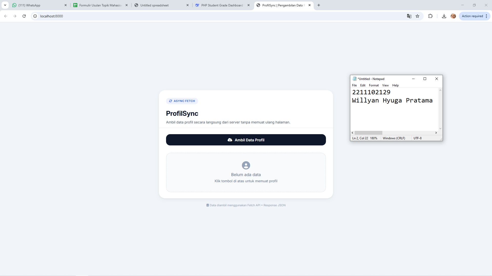
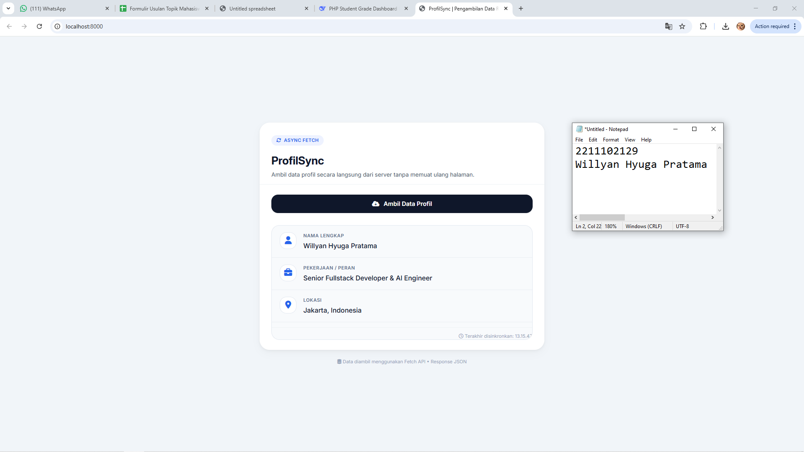

<div align="center">
    <br />
    <h1>LAPORAN PRAKTIKUM <br> APLIKASI BERBASIS PLATFORM </h1>
    <br />
    <h3>MODUL 10 <br> AJAX </h3>
    <br />
    
    <br />
    <br />
    <br />
    <h3>Disusun Oleh :</h3>
    <p>
        <strong>Willyan Hyuga Pratama</strong>
        <br>
        <strong>2211102129</strong>
        <br>
        <strong>S1 IF-11-REG05</strong>
    </p>
    <br />
    <h3>Dosen Pengampu :</h3>
    <p>
        <strong>Dedi Agung Prabowo, S.Kom., M.Kom</strong>
    </p>
    <br />
    <br />
    <h4>Asisten Praktikum :</h4>
    <strong>Apri Pandu Wicaksono </strong>
    <br>
    <strong>Hamka Zaenul Ardi</strong>
    <br />
    <h3>LABORATORIUM HIGH PERFORMANCE <br>FAKULTAS INFORMATIKA <br>UNIVERSITAS TELKOM PURWOKERTO <br>2026 </h3>
</div>
<hr>

## Dasar Teori

AJAX (Asynchronous JavaScript and XML) merupakan teknik pemrograman web yang memungkinkan halaman web berkomunikasi dengan server secara asinkron di latar belakang, tanpa harus memuat ulang keseluruhan halaman. Istilah ini pertama kali diperkenalkan oleh Jesse James Garrett pada tahun 2005, meskipun teknologi penyusunnya (seperti XMLHttpRequest) telah ada sebelumnya. Tujuan utama AJAX adalah menciptakan pengalaman pengguna yang lebih responsif dan mirip dengan aplikasi desktop, karena hanya sebagian kecil konten halaman yang diperbarui ketika terjadi interaksi, seperti mengirim formulir, memuat data tambahan, atau melakukan validasi input secara langsung.

Secara teknis, AJAX menggabungkan beberapa teknologi: JavaScript sebagai pengendali logika dan event, XMLHttpRequest (atau Fetch API modern) sebagai objek perantara yang mengirim dan menerima permintaan ke server, serta format data seperti XML, JSON, atau teks biasa untuk pertukaran informasi. Meskipun namanya mengandung XML, saat ini JSON (JavaScript Object Notation) lebih sering digunakan karena lebih ringan, mudah dibaca, dan native terhadap JavaScript. Alur kerja AJAX sederhana: pengguna memicu event (misal klik tombol) → JavaScript membuat objek permintaan → mengirim permintaan HTTP ke server → server memproses dan mengembalikan respons → JavaScript menangkap respons lalu memperbarui elemen HTML tertentu tanpa mengganggu tampilan lainnya.

Implementasi AJAX dapat ditemukan pada berbagai aplikasi web modern, seperti Google Maps (memuat peta secara dinamis), YouTube (memuat komentar tanpa refresh), Gmail (pengiriman email asinkron), serta sistem dashboard real-time dan form validasi yang umum digunakan dalam pengembangan website. Dalam kode website ProfilSync yang telah dibuat, AJAX diwujudkan melalui fetch() API untuk mengambil data profil dari server (file data.php) ketika tombol ditekan, lalu menampilkan hasilnya tanpa me-refresh halaman — inilah inti dari pengalaman web yang mulus dan efisien.

## Tugas Modul 10 - AJAX

### Source Code

```php
<?php
<?php
header('Content-Type: application/json');
header('Cache-Control: no-cache, must-revalidate');

$profile = [
    'nama'      => 'Willyan Hyuga Pratama',
    'pekerjaan' => 'Senior Fullstack Developer & AI Engineer',
    'lokasi'    => 'Jakarta, Indonesia'
];

echo json_encode($profile);
?>
```

**Kode Lengkap:** [data.php](data.php)

```html
<!DOCTYPE html>
<html lang="id">
<head>
    <meta charset="UTF-8">
    <meta name="viewport" content="width=device-width, initial-scale=1.0, user-scalable=yes">
    <title>ProfilSync | Pengambilan Data Real-time</title>
    <link href="https://fonts.googleapis.com/css2?family=Inter:opsz,wght@14..32,400;14..32,500;14..32,600;14..32,700&display=swap" rel="stylesheet">
    <link rel="stylesheet" href="https://cdnjs.cloudflare.com/ajax/libs/font-awesome/6.5.1/css/all.min.css">
    <style>
        * {
            margin: 0;
            padding: 0;
            box-sizing: border-box;
        }

        body {
            font-family: 'Inter', -apple-system, BlinkMacSystemFont, sans-serif;
            background: #f1f5f9;
            min-height: 100vh;
            display: flex;
            align-items: center;
            justify-content: center;
            padding: 1.5rem;
            line-height: 1.5;
        }

        /* Container utama – sentral, lebar terbatas untuk kenyamanan baca */
        .app-container {
            max-width: 680px;
            width: 100%;
            margin: 0 auto;
        }

        /* Kartu utama */
        .card {
            background: #ffffff;
            border-radius: 1.5rem;
            box-shadow: 0 8px 20px rgba(0, 0, 0, 0.03), 0 2px 6px rgba(0, 0, 0, 0.05);
            overflow: hidden;
            transition: box-shadow 0.2s ease;
        }

        /* Header kartu */
        .card-header {
            padding: 1.75rem 1.75rem 0.75rem 1.75rem;
            border-bottom: 1px solid #eef2f6;
        }
```

**Kode Lengkap:** [index.html](index.html)

Output:



### Penjelasan

Website ini adalah aplikasi web modern yang memanfaatkan JavaScript Fetch API untuk mengambil data profil (nama, pekerjaan, lokasi) dari server secara asinkron (AJAX) tanpa perlu me-refresh halaman. Dengan antarmuka yang bersih, responsif, dan mengikuti prinsip UX profesional, pengguna cukup menekan satu tombol untuk melihat informasi profil yang diperbarui secara real-time, lengkap dengan indikator loading dan penanganan error yang informatif.

