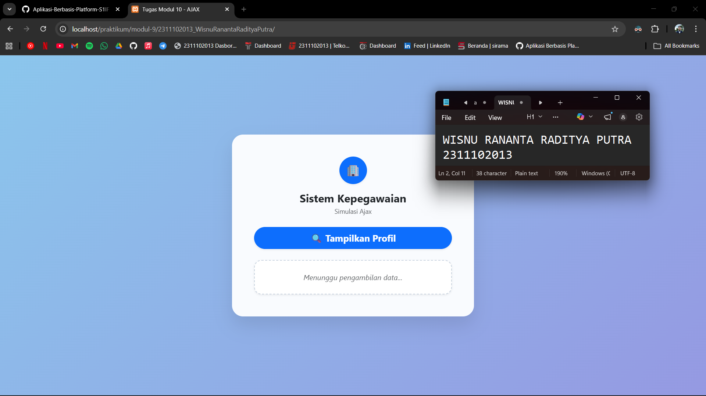
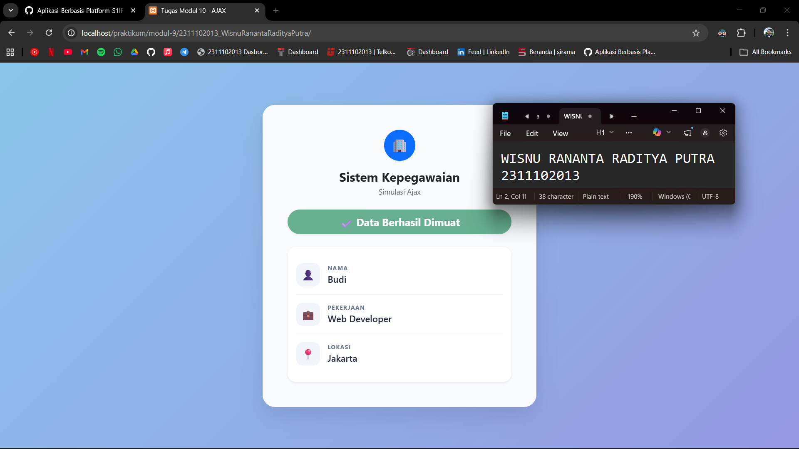

<div align="center">
  <br />
  <h1>LAPORAN PRAKTIKUM <br> APLIKASI BERBASIS PLATFORM </h1>
  <br />
  <h3>MODUL 10 <br> AJAX </h3>
  <br />
  
  <br />
  <br />
  <br />
  <h3>Disusun Oleh :</h3>
  <p>
    <strong>Wisnu Rananta Raditya Putra</strong>
    <br>
    <strong>2311102013</strong>
    <br>
    <strong>S1 IF-11-REG05</strong>
  </p>
  <br />
  <h3>Dosen Pengampu :</h3>
  <p>
    <strong>Dedi Agung Prabowo, S.Kom., M.Kom</strong>
  </p>
  <br />
  <br />
  <h4>Asisten Praktikum :</h4>
  <strong>Apri Pandu Wicaksono </strong>
  <br>
  <strong>Hamka Zaenul Ardi</strong>
  <br />
  <h3>LABORATORIUM HIGH PERFORMANCE <br>FAKULTAS INFORMATIKA <br>UNIVERSITAS TELKOM PURWOKERTO <br>2026 </h3>
</div>

<hr>

# Dasar Teori

<p align="justify">
AJAX (Asynchronous JavaScript and XML) adalah teknik dalam pengembangan web yang memungkinkan aplikasi berkomunikasi dengan server secara asynchronous tanpa harus memuat ulang (reload) seluruh halaman. Dengan memanfaatkan JavaScript, AJAX menggunakan objek seperti <code>XMLHttpRequest</code> atau teknologi modern seperti <code>fetch API</code> untuk mengirim dan menerima data di latar belakang. Data yang dipertukarkan tidak terbatas pada XML saja, tetapi juga dapat berupa JSON, teks, atau HTML.
</p>

<p align="justify">
Penggunaan AJAX memungkinkan bagian tertentu dari halaman web diperbarui secara dinamis sesuai kebutuhan tanpa mengganggu keseluruhan tampilan. Teknologi ini banyak digunakan dalam aplikasi web modern, seperti fitur pencarian otomatis, validasi form secara real-time, serta pengambilan data secara cepat. Dengan demikian, AJAX membantu meningkatkan efisiensi, kecepatan, dan interaktivitas dalam pengalaman pengguna.
</p>


## Tugas Modul 10 - AJAX
### Souce code - data.php
```php
<?php
header('Content-Type: application/json');

$data = [
    'nama' => 'Budi',
    'pekerjaan' => 'Web Developer',
    'lokasi' => 'Jakarta'
];

echo json_encode($data);
?>
```

### Source code - index.html
```html
<!DOCTYPE html>
<html lang="id">
<head>
    <meta charset="UTF-8">
    <meta name="viewport" content="width=device-width, initial-scale=1.0">
    <title>Tugas Modul 10 - AJAX</title>
    
    <link href="https://cdn.jsdelivr.net/npm/bootstrap@5.3.0/dist/css/bootstrap.min.css" rel="stylesheet">
    
    <style>
        body {
            background: linear-gradient(135deg, #8BC6EC 0%, #9599E2 100%);
            background-attachment: fixed;
            min-height: 100vh;
            display: flex;
            align-items: center; 
        }

        .glass-card {
            background: rgba(255, 255, 255, 0.95);
            backdrop-filter: blur(10px);
            border-radius: 1.5rem;
            box-shadow: 0 20px 40px rgba(0, 0, 0, 0.1);
            border: 1px solid rgba(255, 255, 255, 0.5);
        }

        .info-row {
            display: flex;
            align-items: center;
            padding: 15px 0;
            border-bottom: 1px solid rgba(0, 0, 0, 0.05);
        }

        .info-row:last-child {
            border-bottom: none;
        }

        .icon-box {
            width: 45px;
            height: 45px;
            background: #f1f5f9;
            border-radius: 12px;
            display: flex;
            align-items: center;
            justify-content: center;
            margin-right: 15px;
            font-size: 20px;
        }

        .label-text {
            color: #64748b;
            font-size: 0.7rem;
            text-transform: uppercase;
            font-weight: 700;
            letter-spacing: 1px;
            margin-bottom: 0;
        }

        .value-text {
            color: #1e293b;
            font-size: 1.1rem;
            font-weight: 600;
            margin-bottom: 0;
        }

        .btn-custom { transition: all 0.3s ease; }
        .btn-custom:hover { 
            transform: translateY(-2px); 
            box-shadow: 0 8px 20px rgba(13, 110, 253, 0.3) !important; 
        }

        .border-dashed { border: 2px dashed #cbd5e1 !important; }

        @keyframes fadeIn {
            from { opacity: 0; transform: translateY(10px); }
            to { opacity: 1; transform: translateY(0); }
        }
    </style>
</head>
<body>

    <div class="container py-5 w-100">
        <div class="row justify-content-center">
            <div class="col-md-7 col-lg-5">
                
                <div class="card glass-card border-0">
                    <div class="card-body p-4 p-md-5">
                        
                        <div class="text-center mb-4">
                            <div class="bg-primary text-white rounded-circle d-inline-flex align-items-center justify-content-center mb-3 shadow-sm" style="width: 60px; height: 60px; font-size: 24px;">
                                🏢
                            </div>
                            <h4 class="text-dark fw-bold mb-0">Sistem Kepegawaian</h4>
                            <p class="text-muted small mt-1">Simulasi Ajax</p>
                        </div>
                        
                        <button id="btn-tampil" class="btn btn-primary btn-custom btn-lg rounded-pill px-4 shadow-sm w-100 mb-4 fw-bold">
                            🔍 Tampilkan Profil
                        </button>
                        
                        <div id="hasil-profil">
                            <div class="p-4 border-dashed rounded-4 bg-white text-muted shadow-sm text-center">
                                <em>Menunggu pengambilan data...</em>
                            </div>
                        </div>

                    </div>
                </div>

            </div>
        </div>
    </div>

    <script>
        document.getElementById('btn-tampil').addEventListener('click', function() {
            const btn = this;
            const hasilDiv = document.getElementById('hasil-profil');

            btn.innerHTML = '<span class="spinner-border spinner-border-sm me-2" role="status" aria-hidden="true"></span> Memuat...';
            btn.disabled = true;

            fetch('data.php')
                .then(response => {
                    if (!response.ok) throw new Error('Gagal koneksi');
                    return response.json();
                })
                .then(data => {
                    btn.innerHTML = '✔️ Data Berhasil Dimuat';
                    btn.classList.replace('btn-primary', 'btn-success'); 
                    
                    setTimeout(() => {
                        btn.disabled = false; 
                        btn.innerHTML = '🔍 Tampilkan Profil'; 
                        btn.classList.replace('btn-success', 'btn-primary');
                    }, 1500);

                    hasilDiv.innerHTML = `
                        <div class="p-3 bg-white rounded-4 shadow-sm border border-light" style="animation: fadeIn 0.5s;">
                            <div class="info-row">
                                <div class="icon-box">👤</div>
                                <div>
                                    <p class="label-text">NAMA</p>
                                    <p class="value-text">${data.nama}</p>
                                </div>
                            </div>
                            
                            <div class="info-row">
                                <div class="icon-box">💼</div>
                                <div>
                                    <p class="label-text">PEKERJAAN</p>
                                    <p class="value-text">${data.pekerjaan}</p>
                                </div>
                            </div>
                            
                            <div class="info-row">
                                <div class="icon-box">📍</div>
                                <div>
                                    <p class="label-text">LOKASI</p>
                                    <p class="value-text">${data.lokasi}</p>
                                </div>
                            </div>
                        </div>
                    `;
                })
                .catch(error => {
                    btn.innerHTML = '❌ Gagal';
                    btn.classList.replace('btn-primary', 'btn-danger');
                    btn.disabled = false;
                    hasilDiv.innerHTML = `<div class="p-3 text-danger text-center fw-bold">Koneksi data.php gagal.</div>`;
                });
        });
    </script>

    <script src="https://cdn.jsdelivr.net/npm/bootstrap@5.3.0/dist/js/bootstrap.bundle.min.js"></script>
</body>
</html>
```

### Screenshots Output



# Penjelasan
<p align="justify">
Kode tersebut merupakan contoh penggunaan AJAX dengan <code>fetch</code> untuk mengambil data dari server <code>(data.php)</code> dalam format JSON tanpa reload halaman. Pada <code>data.php</code>, data profil disimpan dalam array lalu dikonversi menjadi JSON menggunakan <code>json_encode</code> agar dapat dibaca oleh JavaScript.
</p>

<p align="justify">
Pada <code>index.html</code>, saat tombol diklik, JavaScript akan mengambil data dari server dan menampilkannya secara dinamis ke halaman. Selama proses, tombol menampilkan loading, lalu berubah saat berhasil atau gagal. Hal ini membuat tampilan web lebih interaktif dan efisien.
</p>