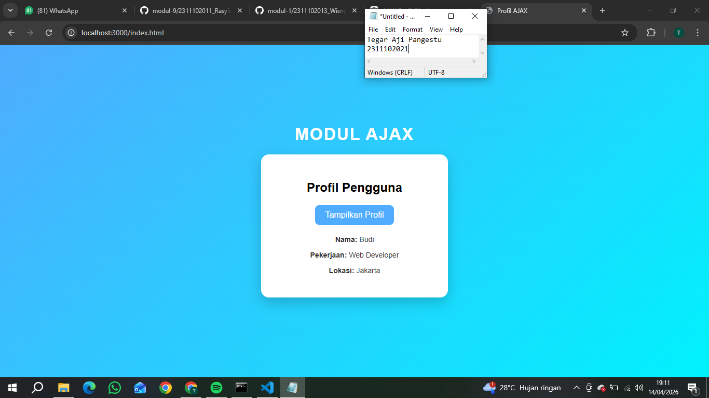

<div align="center">
  <br />
  <h1>LAPORAN PRAKTIKUM <br> APLIKASI BERBASIS PLATFORM </h1>
  <br />
  <h3>MODUL 10 <br> AJAX </h3>
  <br />
  
  <br />
  <br />
  <br />
  <h3>Disusun Oleh :</h3>
  <p>
    <strong>Tegar Aji Pangestu</strong>
    <br>
    <strong>2311102021</strong>
    <br>
    <strong>S1 IF-11-REG05</strong>
  </p>
  <br />
  <h3>Dosen Pengampu :</h3>
  <p>
    <strong>Dedi Agung Prabowo, S.Kom., M.Kom</strong>
  </p>
  <br />
  <br />
  <h4>Asisten Praktikum :</h4>
  <strong>Apri Pandu Wicaksono </strong>
  <br>
  <strong>Hamka Zaenul Ardi</strong>
  <br />
  <h3>LABORATORIUM HIGH PERFORMANCE <br>FAKULTAS INFORMATIKA <br>UNIVERSITAS TELKOM PURWOKERTO <br>2026 </h3>
</div>

<hr>

# Dasar Teori

AJAX (Asynchronous JavaScript and XML) adalah teknik dalam pengembangan web yang memungkinkan halaman mengambil atau mengirim data ke server secara asynchronous tanpa perlu melakukan reload halaman. Dengan AJAX, interaksi pengguna menjadi lebih cepat dan responsif karena hanya sebagian data saja yang diperbarui, bukan seluruh halaman. Teknologi ini biasanya menggunakan JavaScript dengan metode seperti fetch() atau XMLHttpRequest untuk berkomunikasi dengan server, dan data yang ditransfer umumnya menggunakan format JSON karena lebih ringan dan mudah diolah dibandingkan XML.

Dalam penerapannya, AJAX sering digunakan pada fitur-fitur modern seperti pencarian otomatis, validasi form tanpa reload, serta pengambilan data dinamis seperti profil pengguna atau komentar. Prosesnya dimulai dari event (misalnya klik tombol), kemudian JavaScript mengirim request ke server, server memproses dan mengembalikan data, lalu hasilnya ditampilkan kembali ke halaman web. Dengan konsep ini, AJAX membantu meningkatkan efisiensi, performa, dan pengalaman pengguna dalam menggunakan aplikasi web.

# Tugas modul 10 - AJAX
## index.html
```<!-- 2311102021
Tegar Aji pangestu
S1IF-11-05 -->
<!DOCTYPE html>
<html lang="id">
<head>
    <meta charset="UTF-8">
    <title>Profil AJAX</title>

    <style>
        body {
            font-family: Arial, sans-serif;
            background: linear-gradient(135deg, #4facfe, #00f2fe);
            height: 100vh;
            margin: 0;
        }

        .container {
            display: flex;
            flex-direction: column;
            align-items: center;
            justify-content: center;
            height: 100%;
        }

        .judul {
            color: white;
            font-size: 32px;
            font-weight: bold;
            margin-bottom: 20px;
            letter-spacing: 2px;
        }

        .card {
            background: white;
            padding: 30px;
            border-radius: 15px;
            box-shadow: 0 10px 25px rgba(0,0,0,0.2);
            text-align: center;
            width: 300px;
            transition: 0.3s;
        }

        .card:hover {
            transform: scale(1.03);
        }

        button {
            background: #4facfe;
            border: none;
            padding: 10px 20px;
            color: white;
            border-radius: 8px;
            cursor: pointer;
            font-size: 16px;
            transition: 0.3s;
        }

        button:hover {
            background: #007bff;
        }

        #hasil-profil {
            margin-top: 20px;
            font-size: 14px;
            color: #333;
        }

        .loading {
            color: gray;
            font-style: italic;
        }
    </style>
</head>
<body>

    <div class="container">
        <!-- Judul Atas -->
        <div class="judul">MODUL AJAX</div>

        <!-- Card -->
        <div class="card">
            <h2> Profil Pengguna</h2>

            <button id="btnProfil">Tampilkan Profil</button>

            <div id="hasil-profil"></div>
        </div>
    </div>

    <script>
        const tombol = document.getElementById("btnProfil");

        tombol.addEventListener("click", function() {
            const hasil = document.getElementById("hasil-profil");

            hasil.innerHTML = "<p class='loading'>Loading...</p>";

            fetch("data.php")
                .then(response => response.json())
                .then(data => {
                    hasil.innerHTML = `
                        <p><b>Nama:</b> ${data.nama}</p>
                        <p><b>Pekerjaan:</b> ${data.pekerjaan}</p>
                        <p><b>Lokasi:</b> ${data.lokasi}</p>
                    `;
                })
                .catch(error => {
                    hasil.innerHTML = "<p style='color:red;'>Gagal mengambil data</p>";
                });
        });
    </script>

</body>
</html>
```

## data.php
```<!-- 2311102021
Tegar Aji pangestu
S1IF-11-05 -->
<?php
header('Content-Type: application/json');

$data = [
    "nama" => "Budi",
    "pekerjaan" => "Web Developer",
    "lokasi" => "Jakarta"
];

echo json_encode($data);
?>
```
Output:


# Penjelasan
Program ini menggunakan AJAX untuk mengambil data dari server tanpa reload halaman. Saat tombol diklik, JavaScript dengan fetch() mengambil data dari data.php, mengubahnya ke format JSON, lalu menampilkannya ke dalam <div id="hasil-profil">. File data.php sendiri mengirim data dalam bentuk JSON menggunakan json_encode(), sehingga halaman menjadi lebih dinamis dan interaktif.
