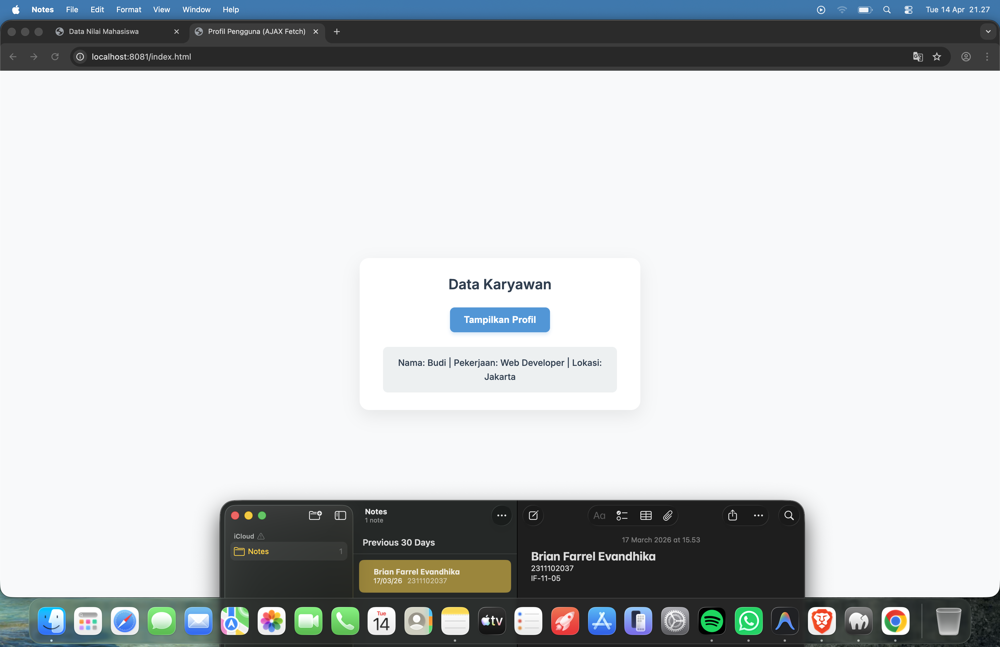

<div align="center">
  <br />
  <h1>LAPORAN PRAKTIKUM <br> APLIKASI BERBASIS PLATFORM </h1>
  <br />
  <h3>MODUL 9 <br> AJAX </h3>
  <br />
  
  <br />
  <br />
  <br />
  <h3>Disusun Oleh :</h3>
  <p>
    <strong>Brian Farrel Evandhika</strong>
    <br>
    <strong>2311102037</strong>
    <br>
    <strong>S1 IF-11-REG05</strong>
  </p>
  <br />
  <h3>Dosen Pengampu :</h3>
  <p>
    <strong>Dedi Agung Prabowo, S.Kom., M.Kom</strong>
  </p>
  <br />
  <br />
  <h4>Asisten Praktikum :</h4>
  <strong>Apri Pandu Wicaksono </strong>
  <br>
  <strong>Hamka Zaenul Ardi</strong>
  <br />
  <h3>LABORATORIUM HIGH PERFORMANCE <br>FAKULTAS INFORMATIKA <br>UNIVERSITAS TELKOM PURWOKERTO <br>2026 </h3>
</div>

<hr>

# Dasar Teori

<p align="justify">
AJAX (Asynchronous JavaScript and XML) adalah teknik dalam pengembangan web yang memungkinkan aplikasi berkomunikasi dengan server secara asynchronous tanpa harus memuat ulang (reload) seluruh halaman. Dengan memanfaatkan JavaScript, AJAX menggunakan objek seperti <code>XMLHttpRequest</code> atau teknologi modern seperti <code>fetch API</code> untuk mengirim dan menerima data di latar belakang. Data yang dipertukarkan tidak terbatas pada XML saja, tetapi juga dapat berupa JSON, teks, atau HTML.
</p>

<p align="justify">
Penggunaan AJAX memungkinkan bagian tertentu dari halaman web diperbarui secara dinamis sesuai kebutuhan tanpa mengganggu keseluruhan tampilan. Teknologi ini banyak digunakan dalam aplikasi web modern, seperti fitur pencarian otomatis, validasi form secara real-time, serta pengambilan data secara cepat. Dengan demikian, AJAX membantu meningkatkan efisiensi, kecepatan, dan interaktivitas dalam pengalaman pengguna.
</p>


## Tugas Modul 9 - AJAX
### Souce code - data.php
```php
<?php
header('Content-Type: application/json');

$data = [
    'nama' => 'Budi',
    'pekerjaan' => 'Web Developer',
    'lokasi' => 'Jakarta'
];

echo json_encode($data);
?>
```

### Source code - index.html
```html
<!DOCTYPE html>
<html lang="id">
<head>
    <meta charset="UTF-8">
    <meta name="viewport" content="width=device-width, initial-scale=1.0">
    <title>Profil Pengguna (AJAX Fetch)</title>
    <style>
        body {
            font-family: 'Inter', -apple-system, BlinkMacSystemFont, 'Segoe UI', Roboto, Helvetica, Arial, sans-serif;
            background-color: #f8f9fa;
            color: #333;
            display: flex;
            justify-content: center;
            align-items: center;
            height: 100vh;
            margin: 0;
        }
        .card {
            background: #ffffff;
            padding: 30px 40px;
            border-radius: 16px;
            box-shadow: 0 10px 30px rgba(0, 0, 0, 0.08);
            text-align: center;
            max-width: 400px;
            width: 100%;
        }
        h2 {
            margin-top: 0;
            color: #2c3e50;
            font-size: 24px;
            margin-bottom: 25px;
        }
        button {
            background-color: #3498db;
            color: white;
            border: none;
            padding: 12px 24px;
            font-size: 16px;
            font-weight: 600;
            border-radius: 8px;
            cursor: pointer;
            transition: all 0.2s ease;
            box-shadow: 0 4px 6px rgba(52, 152, 219, 0.2);
        }
        button:hover {
            background-color: #2980b9;
            transform: translateY(-2px);
            box-shadow: 0 6px 12px rgba(52, 152, 219, 0.3);
        }
        button:active {
            transform: translateY(0);
            box-shadow: 0 2px 4px rgba(52, 152, 219, 0.2);
        }
        #hasil-profil {
            margin-top: 25px;
            padding: 15px;
            border-radius: 8px;
            background-color: #ecf0f1;
            color: #2c3e50;
            font-weight: 500;
            font-size: 15px;
            line-height: 1.6;
            display: none;
            text-align: center;
        }
    </style>
    <link href="https://fonts.googleapis.com/css2?family=Inter:wght@400;500;600&display=swap" rel="stylesheet">
</head>
<body>

    <div class="card">
        <h2>Data Karyawan</h2>
        <button id="btn-tampil">Tampilkan Profil</button>
        <div id="hasil-profil"></div>
    </div>

    <script>
        document.getElementById('btn-tampil').addEventListener('click', function() {
            // Menggunakan fetch API untuk mengambil data dari data.php
            fetch('data.php')
                .then(response => {
                    if (!response.ok) {
                        throw new Error('Jaringan bermasalah atau file tidak ditemukan.');
                    }
                    return response.json(); // Parsing response body text sebagai JSON
                })
                .then(data => {
                    // Update tampilan dengan data yang diterima dengan format yang diminta
                    const hasilProfil = document.getElementById('hasil-profil');
                    hasilProfil.innerHTML = `Nama: ${data.nama} | Pekerjaan: ${data.pekerjaan} | Lokasi: ${data.lokasi}`;
                    hasilProfil.style.display = 'block';
                    
                    // Sedikit animasi sederhana saat konten muncul
                    hasilProfil.animate([
                        { opacity: 0, transform: 'translateY(10px)' },
                        { opacity: 1, transform: 'translateY(0)' }
                    ], {
                        duration: 400,
                        easing: 'ease-out'
                    });
                })
                .catch(error => {
                    console.error('Terjadi kesalahan:', error);
                    const hasilProfil = document.getElementById('hasil-profil');
                    hasilProfil.innerHTML = `<span style="color: red;">Gagal mengambil data. Pastikan server PHP berjalan.</span>`;
                    hasilProfil.style.display = 'block';
                });
        });
    </script>
</body>
</html>
```

### Screenshots Output

<br>


# Penjelasan
<p align="justify">
Kode tersebut merupakan contoh penggunaan AJAX dengan <code>fetch</code> untuk mengambil data dari server <code>(data.php)</code> dalam format JSON tanpa reload halaman. Pada <code>data.php</code>, data profil disimpan dalam array lalu dikonversi menjadi JSON menggunakan <code>json_encode</code> agar dapat dibaca oleh JavaScript.
</p>

<p align="justify">
Pada <code>index.html</code>, saat tombol diklik, JavaScript akan mengambil data dari server dan menampilkannya secara dinamis ke halaman. Selama proses, fetch API digunakan untuk menarik data JSON dari backend dan menampilkannya dengan mulus menggunakan manipulasi DOM beserta efek transisi yang interaktif. Hal ini membuat keseluruhan tampilan web berasa efisien karena tidak diperlukan pemuatan ulang seluruh halaman.
</p>
