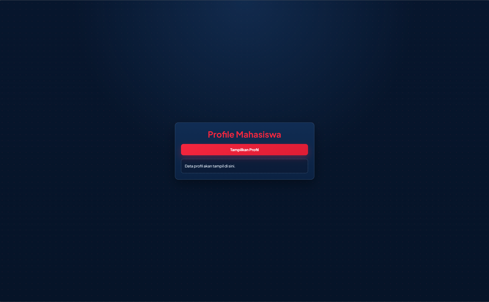
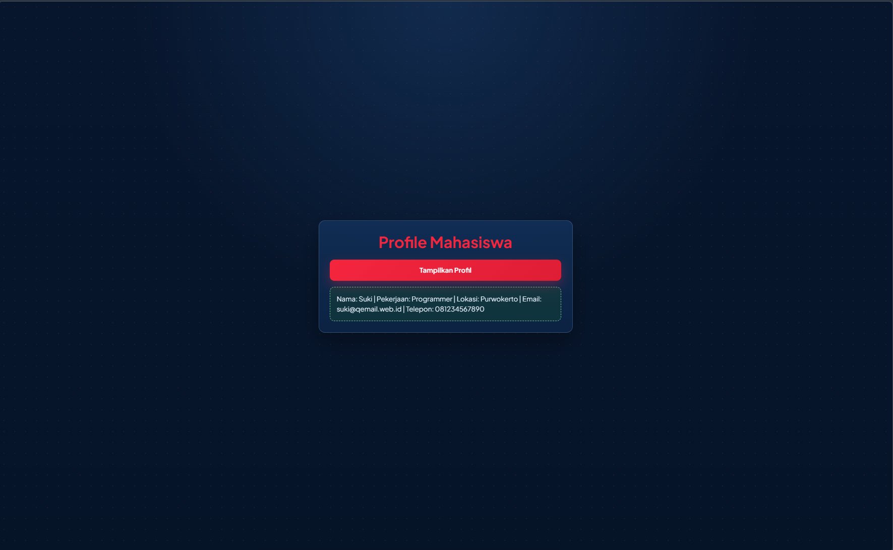
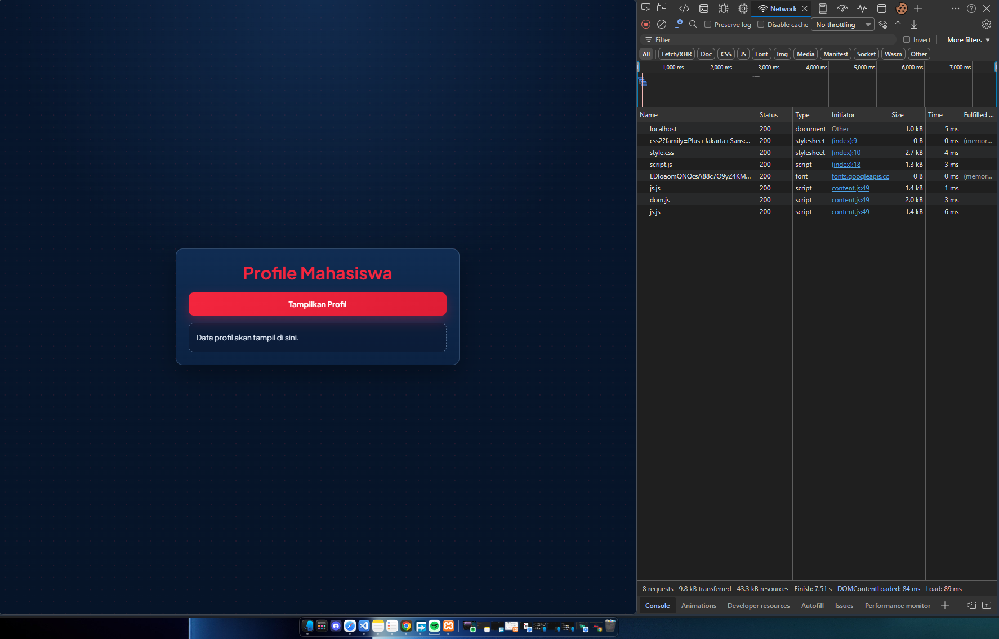
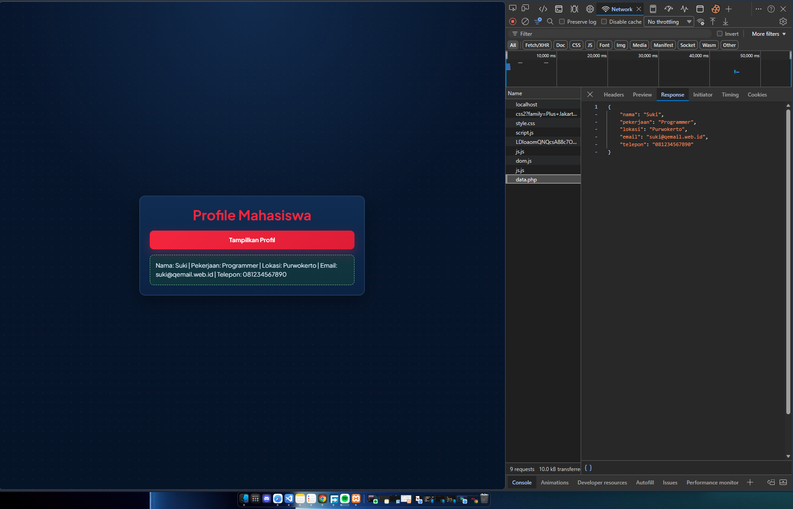

<div align="center">
  <br />
  <h1>LAPORAN PRAKTIKUM <br> APLIKASI BERBASIS PLATFORM </h1>
  <br />
  <h3>MODUL 10 <br> AJAX </h3>
  <br />
  
  <br />
  <br />
  <br />
  <h3>Disusun Oleh :</h3>
  <p>
    <strong>Muhammad Aulia Muzzaki Nugraha</strong>
    <br>
    <strong>2311102051</strong>
    <br>
    <strong>S1 IF-11-REG05</strong>
  </p>
  <br />
  <h3>Dosen Pengampu :</h3>
  <p>
    <strong>Dedi Agung Prabowo, S.Kom., M.Kom</strong>
  </p>
  <br />
  <br />
  <h4>Asisten Praktikum :</h4>
  <strong>Apri Pandu Wicaksono </strong>
  <br>
  <strong>Hamka Zaenul Ardi</strong>
  <br />
  <h3>LABORATORIUM HIGH PERFORMANCE <br>FAKULTAS INFORMATIKA <br>UNIVERSITAS TELKOM PURWOKERTO <br>2026 </h3>
</div>

<hr>

# Dasar Teori

AJAX (Asynchronous JavaScript and XML) adalah teknik pada aplikasi web untuk mengirim dan mengambil data dari server secara asynchronous tanpa melakukan reload seluruh halaman. Walaupun namanya mengandung XML, saat ini format data yang paling umum dipakai adalah JSON karena lebih ringkas dan mudah diproses di JavaScript.

Pada aplikasi web tradisional, setiap interaksi penting biasanya membutuhkan refresh halaman. Dengan AJAX, browser cukup meminta data yang diperlukan saja, lalu JavaScript memperbarui sebagian tampilan (DOM). Hasilnya, aplikasi terasa lebih cepat, interaktif, dan responsif.

## Konsep Dasar AJAX

1. Asynchronous Request
JavaScript dapat menjalankan request ke server di background, sehingga halaman tetap bisa digunakan oleh pengguna.

2. Client-Server Communication
Browser bertindak sebagai client yang mengirim request HTTP ke endpoint server (contoh: data.php), lalu server mengirim response.

3. Data Interchange Format
Data umumnya dikirim dalam format JSON karena mudah diubah ke object JavaScript menggunakan response.json().

4. DOM Manipulation
Setelah data diterima, JavaScript memperbarui elemen tertentu pada halaman, misalnya div hasil, tanpa reload.

5. Error Handling
AJAX wajib memiliki penanganan error untuk kondisi jaringan gagal, status HTTP tidak sukses, atau format data tidak sesuai.

## Komponen Utama AJAX

1. Trigger Event
Pemicu dari sisi user atau sistem, misalnya klik tombol Tampilkan Profil.

2. JavaScript Request Engine
Kode JavaScript yang melakukan request, seperti fetch API, XMLHttpRequest, atau jQuery AJAX.

3. Server Endpoint
File backend yang memproses request lalu mengembalikan data, pada tugas ini menggunakan data.php.

4. Response Data
Isi data dari server, umumnya JSON.

5. UI Renderer
Bagian JavaScript yang menampilkan data ke halaman dengan memodifikasi DOM.

## Alur Kerja AJAX

1. User melakukan aksi (klik tombol).
2. JavaScript mengirim request ke server.
3. Server membaca data dan membentuk response JSON.
4. Browser menerima response.
5. JavaScript mem-parsing JSON.
6. JavaScript memperbarui elemen di halaman.
7. Jika gagal, tampilkan pesan error.

## Metode Implementasi AJAX

### 1. Fetch API (Modern)

```javascript
const response = await fetch('data.php');
const data = await response.json();
```

Kelebihan: sintaks lebih ringkas, mendukung Promise, cocok untuk kode modern.

### 2. XMLHttpRequest (Legacy)

```javascript
const xhr = new XMLHttpRequest();
xhr.open('GET', 'data.php');
xhr.onload = function () {
  if (xhr.status === 200) {
    const data = JSON.parse(xhr.responseText);
    console.log(data);
  }
};
xhr.send();
```

Kelebihan: kompatibilitas lama. Kekurangan: lebih verbose.

### 3. jQuery AJAX

```javascript
$.ajax({
  url: 'data.php',
  method: 'GET',
  dataType: 'json',
  success: function (data) {
    console.log(data);
  }
});
```
Kelebihan: praktis jika proyek memakai jQuery.


## Task : AJAX
Buat sebuah halaman web yang bisa mengambil data dari server lalu menampilkannya di halaman tanpa perlu reload.

### Data
```php
[
    'nama' => 'Suki',
    'pekerjaan' => 'Programmer',
    'lokasi' => 'Purwokerto',
    'email' => 'suki@qemail.web.id',
    'telepon' => '081234567890'
];
```
Kode Lengkap: [data.php](data.php)
### Source Code index.html
Kode Lengkap: [index.html](index.html)
### Source Code style.css
Kode Lengkap: [style.css](style.css)
### Source Code script.js
Kode Lengkap: [script.js](script.js)


### Screenshot Output



### Cek Respons



### Penjelasan Program

Program ini adalah contoh AJAX sederhana untuk menampilkan profil mahasiswa tanpa reload halaman.

Struktur program dibagi menjadi 4 bagian:

1. data.php
Berfungsi sebagai sumber data. File ini menyimpan data profil dalam array PHP lalu mengubahnya ke format JSON menggunakan json_encode().

2. index.html
Berfungsi sebagai tampilan utama. Di halaman ini ada judul, tombol Tampilkan Profil, dan area hasil untuk menampilkan data dari server.

3. script.js
Berfungsi sebagai logika AJAX. Saat tombol diklik, JavaScript mengambil data dari data.php menggunakan fetch(), lalu menampilkan hasilnya ke halaman.

4. style.css
Berfungsi untuk mengatur tampilan agar halaman terlihat rapi, modern, dan mudah dibaca.

## Cara Kerja Program

1. Halaman dibuka
Browser memuat index.html, style.css, dan script.js.

2. Tombol diklik
Saat user menekan tombol Tampilkan Profil, script.js menjalankan request ke server.

3. Request ke server
JavaScript mengirim fetch ke data.php untuk meminta data profil.

4. Server mengirim response
data.php mengembalikan data dalam bentuk JSON (nama, pekerjaan, lokasi, email, telepon).

5. Data ditampilkan
script.js membaca JSON, menyusun teks profil, lalu menaruh hasilnya ke elemen hasil-profil.

6. Penanganan kondisi
Jika proses berjalan normal, hasil ditandai status success.
Jika gagal (misalnya server tidak aktif), muncul pesan error.


Program ini menunjukkan konsep utama AJAX: mengambil data dari server secara asynchronous lalu menampilkan hasil di halaman tanpa refresh. Dengan cara ini, interaksi web menjadi lebih cepat dan nyaman untuk pengguna.
