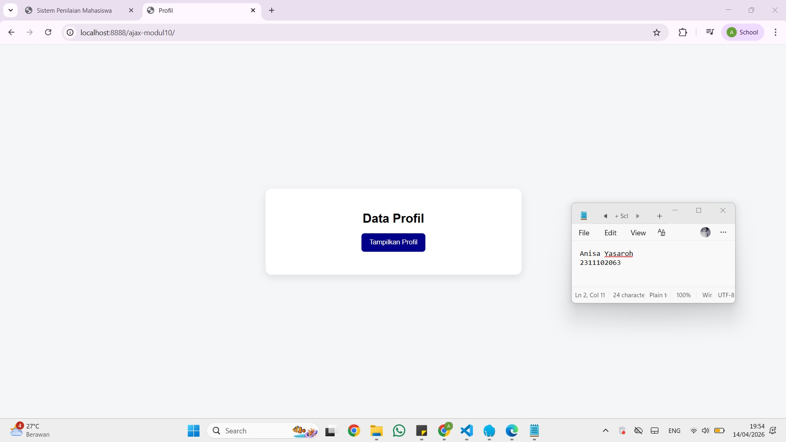
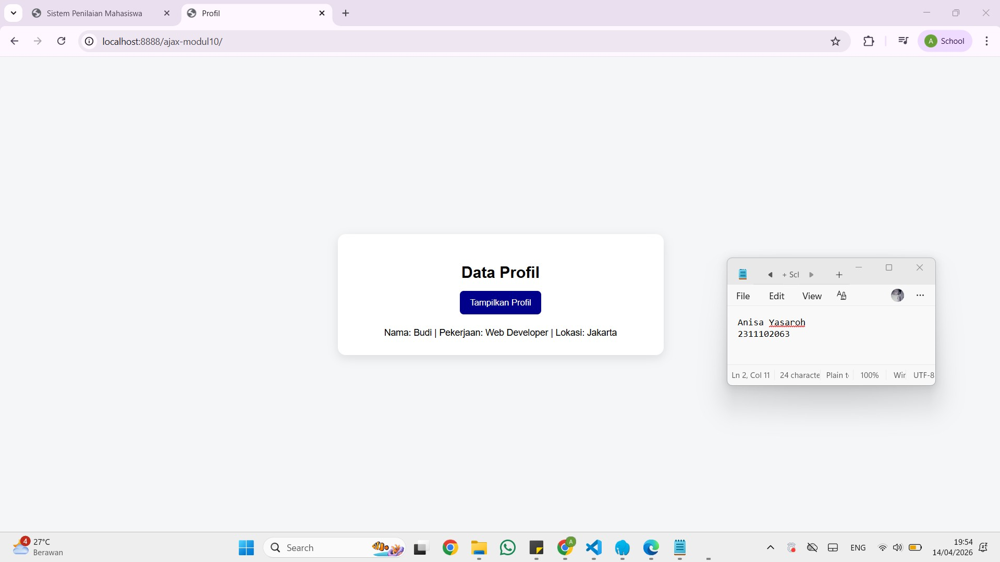

<div align="center">
  <br />
  <h1>LAPORAN PRAKTIKUM <br> APLIKASI BERBASIS PLATFORM </h1>
  <br />
  <h3>MODUL 10 <br> AJAX </h3>
  <br />
  
  <br />
  <br />
  <br />
  <h3>Disusun Oleh :</h3>
  <p>
    <strong>Anisa Yasaroh</strong>
    <br>
    <strong>2311102063</strong>
    <br>
    <strong>S1 IF-11-REG05</strong>
  </p>
  <br />
  <h3>Dosen Pengampu :</h3>
  <p>
    <strong>Dedi Agung Prabowo, S.Kom., M.Kom</strong>
  </p>
  <br />
  <br />
  <h4>Asisten Praktikum :</h4>
  <strong>Apri Pandu Wicaksono </strong>
  <br>
  <strong>Hamka Zaenul Ardi</strong>
  <br />
  <h3>LABORATORIUM HIGH PERFORMANCE <br>FAKULTAS INFORMATIKA <br>UNIVERSITAS TELKOM PURWOKERTO <br>2026 </h3>
</div>

<hr>

## Dasar Teori

AJAX (Asynchronous JavaScript and XML) merupakan teknik dalam pengembangan aplikasi web yang digunakan untuk melakukan pertukaran data antara halaman web dan server secara asynchronous, artinya proses pengiriman dan penerimaan data berlangsung di latar belakang tanpa mengganggu tampilan halaman yang sedang berjalan. Teknik ini biasanya digunakan bersama HTML sebagai struktur tampilan, CSS untuk penataan antarmuka, JavaScript sebagai pengendali logika di sisi klien, serta PHP sebagai pengolah data di sisi server. Dalam praktikum ini, pendekatan yang digunakan adalah fungsi `fetch()` yang merupakan metode modern berbasis Promise dalam JavaScript, memungkinkan halaman web mengirim permintaan HTTP ke server tanpa perlu melakukan reload halaman secara penuh.

Dalam penerapannya, fungsi `fetch()` digunakan untuk mengirim permintaan dari halaman web ke file `data.php` secara asynchronous. File tersebut memproses permintaan yang masuk dan mengembalikan data dalam format JSON (JavaScript Object Notation) menggunakan fungsi `json_encode()` di sisi PHP. Data JSON yang diterima kemudian diurai secara otomatis melalui method `.json()` pada response objek, lalu hasilnya dimanipulasi menggunakan DOM untuk ditampilkan pada elemen `<div>` tertentu di halaman tanpa mempengaruhi keseluruhan tampilan.

Penggunaan AJAX memberikan beberapa keunggulan dalam pengembangan aplikasi web. Server hanya mengirimkan data yang diperlukan, bukan seluruh halaman HTML, sehingga proses pengambilan data menjadi lebih efisien dan beban jaringan dapat dikurangi. Selain itu, pengalaman pengguna menjadi lebih baik karena halaman tidak perlu dimuat ulang setiap kali terjadi permintaan data, sehingga interaksi terasa lebih cepat dan responsif. Dengan demikian, aplikasi web dapat menyajikan informasi secara dinamis dan terstruktur sesuai kebutuhan.

## Tugas Modul 10 - Ajax
### Source code index.html

```
<!-- 2311102063
Anisa Yasaroh
IF-11-REG05 -->

<!DOCTYPE html>
<html lang="id">

<head>
  <meta charset="UTF-8">
  <title>Profil</title>

  <style>
    body {
      font-family: Arial;
      background: #f4f6f8;
      display: flex;
      justify-content: center;
      align-items: center;
      height: 100vh;
      margin: 0;
    }

    .box {
      background: white;
      padding: 25px;
      border-radius: 12px;
      box-shadow: 0 5px 15px rgba(0, 0, 0, 0.1);
      text-align: center;
      width: 450px;
    }

    h2 {
      margin-bottom: 15px;
    }

    button {
      padding: 10px 15px;
      background: darkblue;
      color: white;
      border: none;
      border-radius: 6px;
      cursor: pointer;
    }

    button:hover {
      background: black;
    }

    #hasil-profil {
      margin-top: 20px;
      font-size: 14px;
      white-space: nowrap;
      /* tetap 1 baris */
    }
  </style>
</head>

<body>

  <div class="box">
    <h2>Data Profil</h2>

    <button onclick="tampilkanProfil()">Tampilkan Profil</button>

    <div id="hasil-profil"></div>
  </div>

  <script>
    function tampilkanProfil() {
      fetch('data.php')
        .then(response => response.json())
        .then(data => {
          document.getElementById("hasil-profil").innerHTML =
            "Nama: " + data.nama +
            " | Pekerjaan: " + data.pekerjaan +
            " | Lokasi: " + data.lokasi;
        })
        .catch(error => {
          document.getElementById("hasil-profil").innerHTML = "Error mengambil data";
        });
    }
  </script>

</body>

</html>
```
### Source code data.php
```
<?php
header('Content-Type: application/json');

$data = [
    'nama' => 'Budi',
    'pekerjaan' => 'Web Developer',
    'lokasi' => 'Jakarta'
];

echo json_encode($data);
?>
``` 
### Screenshot Output



### Penjelasan Code

Kode pada `index.html` digunakan untuk membangun tampilan halaman web sederhana yang menampilkan data profil. Struktur halaman terdiri dari elemen utama berupa judul, tombol, dan area untuk menampilkan hasil data. Tampilan diperindah menggunakan CSS internal seperti pengaturan font, warna latar belakang, posisi tengah (center), serta efek bayangan pada kotak (`box`) agar terlihat rapi. Terdapat sebuah tombol “Tampilkan Profil” yang berfungsi untuk memicu pengambilan data dari server. Data yang diterima nantinya akan ditampilkan pada elemen `<div>` dengan id `hasil-profil` dalam satu baris.

Pada bagian JavaScript, digunakan fungsi `tampilkanProfil()` yang memanfaatkan `fetch()` untuk mengambil data dari file `data.php` secara asynchronous. Ketika tombol diklik, browser akan mengirim request ke server dan menerima data dalam format JSON. Data tersebut kemudian diolah dan ditampilkan ke halaman tanpa perlu melakukan reload. Sementara itu, file `data.php` berfungsi sebagai penyedia data dengan format JSON menggunakan `json_encode()`. Dengan konsep ini, AJAX memungkinkan proses pengambilan dan penampilan data menjadi lebih cepat, efisien, dan interaktif.