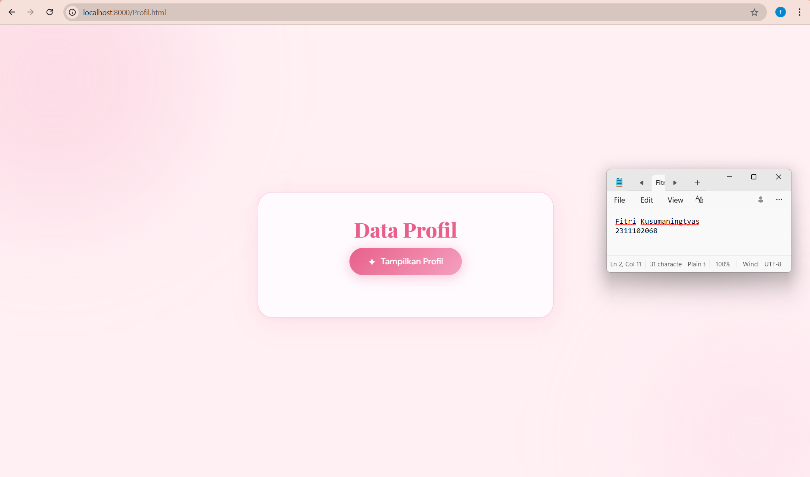
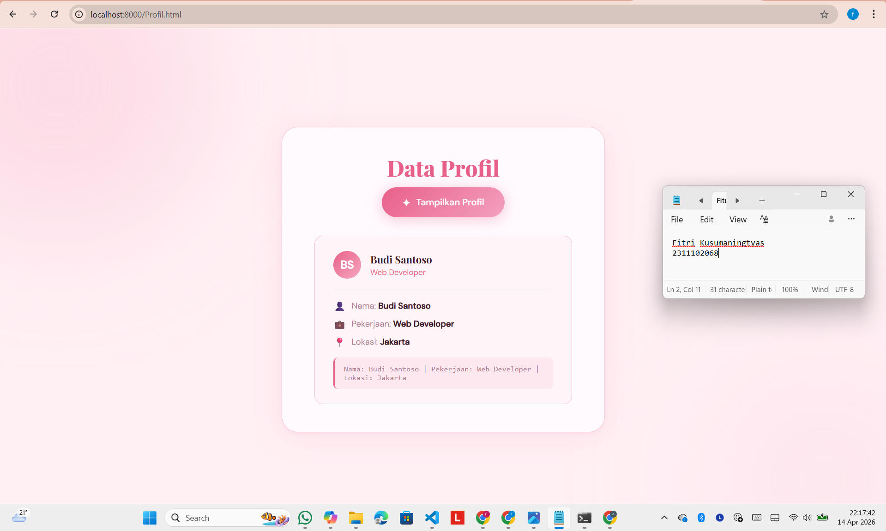

<div align="center">
  <br />
  <h1>LAPORAN PRAKTIKUM <br> APLIKASI BERBASIS PLATFORM </h1>
  <br />
  <h3>MODUL 10 <br> AJAX </h3>
  <br />
  
  <br />
  <br />
  <br />
  <h3>Disusun Oleh :</h3>
  <p>
    <strong>Fitri Kusumaningtyas</strong>
    <br>
    <strong>2311102068</strong>
    <br>
    <strong>S1 IF-11-REG05</strong>
  </p>
  <br />
  <h3>Dosen Pengampu :</h3>
  <p>
    <strong>Dedi Agung Prabowo, S.Kom., M.Kom</strong>
  </p>
  <br />
  <br />
  <h4>Asisten Praktikum :</h4>
  <strong>Apri Pandu Wicaksono </strong>
  <br>
  <strong>Hamka Zaenul Ardi</strong>
  <br />
  <h3>LABORATORIUM HIGH PERFORMANCE <br>FAKULTAS INFORMATIKA <br>UNIVERSITAS TELKOM PURWOKERTO <br>2026 </h3>
</div>

<hr>

## Dasar Teori AJAX
AJAX (Asynchronous JavaScript and XML) adalah teknik dalam pengembangan web yang digunakan untuk mengirim dan mengambil data dari server secara asinkron (tanpa perlu me-reload halaman). AJAX bukanlah satu bahasa pemrograman, melainkan kombinasi dari beberapa teknologi, yaitu JavaScript, DOM (Document Object Model), dan objek XMLHttpRequest atau Fetch API. JavaScript berperan untuk mengirim request ke server, kemudian server merespons dengan data (biasanya dalam format JSON, XML, atau teks), lalu JavaScript akan menampilkan hasilnya ke halaman tanpa refresh.

Konsep utama AJAX adalah komunikasi asinkron, yaitu proses pengiriman data ke server berjalan di belakang layar (background process) tanpa mengganggu aktivitas pengguna di halaman web. Hal ini berbeda dengan metode tradisional yang selalu melakukan reload halaman setiap kali terjadi interaksi dengan server. Penggunaan AJAX banyak diterapkan pada aplikasi modern, seperti fitur pencarian otomatis (autocomplete), komentar real-time, sistem login tanpa refresh, serta dashboard yang menampilkan data dinamis. Dengan adanya AJAX, pengalaman pengguna (user experience) menjadi lebih baik karena interaksi terasa lebih cepat dan seamless.

## Modul 10: Data Pofil (AJAX)
### Source Code Profil.html

```html
<!DOCTYPE html>
<!--Fitri Kusumaningtyas 2311102068-->
<html lang="id">
<head>
  <meta charset="UTF-8" />
  <meta name="viewport" content="width=device-width, initial-scale=1.0" />
  <title>Profil - AJAX</title>
  <link href="https://fonts.googleapis.com/css2?family=Playfair+Display:wght@700;800&family=DM+Sans:wght@400;500&display=swap" rel="stylesheet" />
  <style>
    *, *::before, *::after { box-sizing: border-box; margin: 0; padding: 0; }

    :root {
      --bg:       #fff0f4;
      --surface:  #fffafe;
      --border:   #f5c6d8;
      --accent:   #e8608a;
      --accent2:  #f7a8c0;
      --text:     #3d1a28;
      --muted:    #b07a90;
      --radius:   14px;
    }

    body {
      font-family: 'DM Sans', sans-serif;
      background: var(--bg);
      color: var(--text);
      min-height: 100vh;
      display: flex;
      flex-direction: column;
      align-items: center;
      justify-content: center;
      padding: 2rem;
      overflow: hidden;
    }

    .blob {
      position: fixed;
      border-radius: 50%;
      filter: blur(100px);
      opacity: .35;
      pointer-events: none;
    }
    .blob-1 { width: 520px; height: 520px; background: #f9b8cf; top: -160px; left: -160px; }
    .blob-2 { width: 420px; height: 420px; background: #fcd5e5; bottom: -120px; right: -100px; }

    .card {
      position: relative;
      z-index: 1;
      background: var(--surface);
      border: 1px solid var(--border);
      border-radius: 28px;
      padding: 3rem 3.5rem;
      width: 100%;
      max-width: 560px;
      text-align: center;
      box-shadow: 0 8px 48px rgba(232,96,138,.12), 0 2px 8px rgba(232,96,138,.07);
    }

    h1 {
      font-family: 'Playfair Display', serif;
      font-size: clamp(1.8rem, 5vw, 2.4rem);
      font-weight: 800;
      line-height: 1.15;
      margin-bottom: .75rem;
      color: var(--accent);
    }

    .subtitle {
      color: var(--muted);
      font-size: .95rem;
      margin-bottom: 2.5rem;
      line-height: 1.6;
    }

    #btn-tampilkan {
      cursor: pointer;
      display: inline-flex;
      align-items: center;
      gap: .6rem;
      padding: .85rem 2.2rem;
      font-family: 'DM Sans', sans-serif;
      font-size: 1rem;
      font-weight: 500;
      color: #fff;
      background: linear-gradient(135deg, #e8608a, #f4a0bf);
      border: none;
      border-radius: 999px;
      transition: transform .15s, box-shadow .15s, opacity .15s;
      box-shadow: 0 4px 24px rgba(232,96,138,.35);
    }
    #btn-tampilkan:hover  { transform: translateY(-2px); box-shadow: 0 8px 32px rgba(232,96,138,.45); }
    #btn-tampilkan:active { transform: translateY(0);    opacity: .85; }
    #btn-tampilkan:disabled { opacity: .5; cursor: not-allowed; transform: none; }

    .btn-icon { font-size: 1.1rem; transition: transform .3s; }
    #btn-tampilkan:hover .btn-icon { transform: rotate(20deg); }

    #hasil-profil {
      margin-top: 2rem;
      min-height: 0;
    }

    .profil-box {
      background: #fff5f8;
      border: 1px solid var(--border);
      border-radius: var(--radius);
      padding: 1.6rem 2rem;
      text-align: left;
      animation: slideUp .4s cubic-bezier(.22,1,.36,1) both;
    }

    @keyframes slideUp {
      from { opacity: 0; transform: translateY(16px); }
      to   { opacity: 1; transform: translateY(0); }
    }

    .profil-header {
      display: flex;
      align-items: center;
      gap: 1rem;
      margin-bottom: 1.2rem;
    }
    .avatar {
      width: 48px; height: 48px;
      border-radius: 50%;
      background: linear-gradient(135deg, var(--accent), var(--accent2));
      display: flex; align-items: center; justify-content: center;
      font-size: 1.2rem; font-weight: 700;
      color: #fff;
      flex-shrink: 0;
    }
    .profil-name {
      font-family: 'Playfair Display', serif;
      font-size: 1.1rem;
      font-weight: 700;
      color: var(--text);
    }
    .profil-job {
      font-size: .85rem;
      color: var(--accent);
      margin-top: .1rem;
    }

    .divider {
      height: 1px;
      background: var(--border);
      margin: 1rem 0;
    }

    .profil-row {
      display: flex;
      align-items: center;
      gap: .6rem;
      font-size: .92rem;
      color: var(--muted);
      margin-top: .55rem;
    }
    .profil-row strong { color: var(--text); }
    .profil-row .icon { font-size: 1rem; }

    .plain-text {
      margin-top: 1rem;
      padding: .75rem 1rem;
      background: #fde8f0;
      border-radius: 8px;
      font-size: .82rem;
      color: var(--muted);
      font-family: monospace, sans-serif;
      border-left: 3px solid var(--accent);
    }

    .spinner {
      width: 28px; height: 28px;
      border: 3px solid rgba(232,96,138,.2);
      border-top-color: var(--accent);
      border-radius: 50%;
      animation: spin .7s linear infinite;
      margin: 1.5rem auto 0;
    }
    @keyframes spin { to { transform: rotate(360deg); } }

    .error-box {
      background: rgba(255,80,80,.06);
      border: 1px solid rgba(255,80,80,.2);
      border-radius: var(--radius);
      padding: 1rem 1.4rem;
      color: #e05555;
      font-size: .9rem;
      animation: slideUp .3s ease both;
    }
  </style>
</head>
<body>

  <div class="blob blob-1"></div>
  <div class="blob blob-2"></div>

  <div class="card">
    <h1>Data Profil</h1>

    <button id="btn-tampilkan">
      <span class="btn-icon">✦</span>
      Tampilkan Profil
    </button>

    <div id="hasil-profil"></div>
  </div>

  <script>
    const btn    = document.getElementById('btn-tampilkan');
    const output = document.getElementById('hasil-profil');

    btn.addEventListener('click', function () {
      btn.disabled = true;
      output.innerHTML = '<div class="spinner"></div>';

      fetch('data.php')
        .then(function (response) {
          if (!response.ok) throw new Error('HTTP ' + response.status);
          return response.json();           
        })
        .then(function (data) {
          const inisial = data.nama
            .split(' ')
            .map(function (w) { return w[0]; })
            .slice(0, 2)
            .join('');

          const plainFormat =
            'Nama: ' + data.nama +
            ' | Pekerjaan: ' + data.pekerjaan +
            ' | Lokasi: ' + data.lokasi;

          output.innerHTML =
            '<div class="profil-box">' +
              '<div class="profil-header">' +
                '<div class="avatar">' + inisial + '</div>' +
                '<div>' +
                  '<div class="profil-name">' + data.nama + '</div>' +
                  '<div class="profil-job">' + data.pekerjaan + '</div>' +
                '</div>' +
              '</div>' +
              '<div class="divider"></div>' +
              '<div class="profil-row">' +
                '<span class="icon">👤</span>' +
                '<span>Nama: <strong>' + data.nama + '</strong></span>' +
              '</div>' +
              '<div class="profil-row">' +
                '<span class="icon">💼</span>' +
                '<span>Pekerjaan: <strong>' + data.pekerjaan + '</strong></span>' +
              '</div>' +
              '<div class="profil-row">' +
                '<span class="icon">📍</span>' +
                '<span>Lokasi: <strong>' + data.lokasi + '</strong></span>' +
              '</div>' +
              '<div class="plain-text">' + plainFormat + '</div>' +
            '</div>';

          btn.disabled = false;
        })
        .catch(function (err) {
          output.innerHTML =
            '<div class="error-box">⚠️ Gagal mengambil data: ' + err.message + '</div>';
          btn.disabled = false;
        });
    });
  </script>

</body>
</html>
```
## Source Code Data.php
```php
<?php
header('Content-Type: application/json');
header('Access-Control-Allow-Origin: *');

$profil = [
    ['nama' => 'Budi Santoso',    'pekerjaan' => 'Web Developer',    'lokasi' => 'Jakarta'],
    ['nama' => 'Sari Dewi',       'pekerjaan' => 'UI/UX Designer',   'lokasi' => 'Bandung'],
    ['nama' => 'Rizky Pratama',   'pekerjaan' => 'Data Scientist',   'lokasi' => 'Surabaya'],
    ['nama' => 'Anisa Rahmawati', 'pekerjaan' => 'Project Manager',  'lokasi' => 'Yogyakarta'],
    ['nama' => 'Dimas Ardianto',  'pekerjaan' => 'Backend Engineer', 'lokasi' => 'Medan'],
];

//Pilih profil acak
$index = array_rand($profil);
echo json_encode($profil[$index]);
?>
```

### Screenshot Output



### Penjelasan Code
Kode diatas merupakan implementasi konsep AJAX (Asynchronous JavaScript and XML) yang digunakan untuk mengambil data dari server tanpa perlu me-refresh halaman. Pada bagian HTML, terdapat sebuah tombol “Tampilkan Profil” yang berfungsi sebagai pemicu untuk mengambil data dari server, serta sebuah elemen `div` dengan id `hasil-profil` yang digunakan untuk menampilkan hasil data yang diterima. Ketika tombol ditekan, JavaScript akan menonaktifkan tombol sementara dan menampilkan animasi loading (spinner), kemudian menjalankan fungsi `fetch('data.php')` untuk mengirim request ke file PHP di server secara asinkron.

Setelah request berhasil, server akan mengembalikan data dalam format JSON yang kemudian diproses menggunakan `.then()`. Data tersebut berisi informasi profil seperti nama, pekerjaan, dan lokasi. JavaScript kemudian mengolah data tersebut dengan membuat inisial nama untuk avatar, menyusun format teks biasa (plain text), serta membangun tampilan HTML secara dinamis untuk ditampilkan di halaman tanpa reload. Jika terjadi error, maka akan ditangani oleh `.catch()` dan menampilkan pesan kesalahan kepada pengguna. Dengan demikian, bagian ini menunjukkan bagaimana AJAX memungkinkan pengambilan dan tampilan data secara dinamis dan interaktif.

Sementara itu, kode PHP berfungsi sebagai backend yang menyediakan data untuk diambil oleh AJAX. Pada file PHP, header diatur menggunakan `Content-Type: application/json` agar output dikenali sebagai data JSON, serta `Access-Control-Allow-Origin: *` untuk mengizinkan akses dari berbagai sumber. Di dalamnya terdapat array `$profil` yang berisi beberapa data profil pengguna. Kemudian, fungsi `array_rand()` digunakan untuk memilih satu data profil secara acak dari array tersebut. Data yang terpilih kemudian dikonversi menjadi format JSON menggunakan `json_encode()` dan dikirim ke client (browser). Dengan demikian, PHP berperan sebagai penyedia data, sedangkan HTML dan JavaScript berperan sebagai antarmuka yang mengambil dan menampilkan data secara dinamis menggunakan konsep AJAX.
