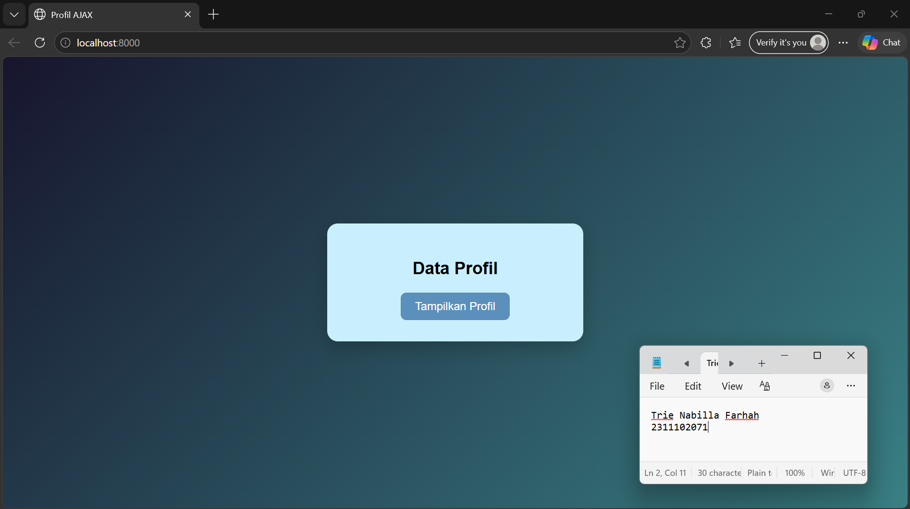
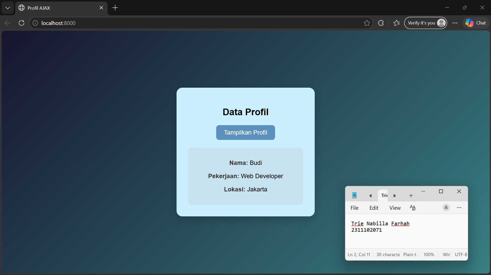

<div align="center">
  <br />
  <h1>LAPORAN PRAKTIKUM <br> APLIKASI BERBASIS PLATFORM </h1>
  <br />
  <h3>MODUL 10 <br> AJAX </h3>
  <br />
  
  <br />
  <br />
  <br />
  <h3>Disusun Oleh :</h3>
  <p>
    <strong>Trie Nabilla Farhah</strong>
    <br>
    <strong>2311102071</strong>
    <br>
    <strong>S1 IF-11-REG05</strong>
  </p>
  <br />
  <h3>Dosen Pengampu :</h3>
  <p>
    <strong>Dedi Agung Prabowo, S.Kom., M.Kom</strong>
  </p>
  <br />
  <br />
  <h4>Asisten Praktikum :</h4>
  <strong>Apri Pandu Wicaksono </strong>
  <br>
  <strong>Hamka Zaenul Ardi</strong>
  <br />
  <h3>LABORATORIUM HIGH PERFORMANCE <br>FAKULTAS INFORMATIKA <br>UNIVERSITAS TELKOM PURWOKERTO <br>2026 </h3>
</div>

<hr>

## Dasar Teori

AJAX (Asynchronous JavaScript and XML) adalah teknik dalam pengembangan web yang digunakan untuk mengirim dan menerima data dari server secara asynchronous tanpa harus me-reload seluruh halaman. Dengan AJAX, halaman web dapat diperbarui sebagian saja (partial update), sehingga membuat aplikasi terasa lebih cepat dan responsif bagi pengguna. Meskipun namanya mengandung XML, saat ini AJAX lebih sering menggunakan format data seperti JSON karena lebih ringan dan mudah diproses.

Konsep utama AJAX adalah komunikasi antara client (browser) dan server menggunakan JavaScript, biasanya melalui objek `XMLHttpRequest` atau `fetch API`. Ketika pengguna melakukan suatu aksi, seperti klik tombol atau mengisi form, JavaScript akan mengirim permintaan ke server, lalu server memprosesnya dan mengembalikan data. Data tersebut kemudian ditampilkan langsung ke halaman tanpa perlu memuat ulang (refresh), sehingga meningkatkan pengalaman pengguna (user experience).

AJAX banyak digunakan dalam berbagai fitur modern seperti autocomplete pencarian, validasi form secara real-time, live chat, dan update data tanpa reload. Dengan memanfaatkan AJAX, pengembang dapat membuat aplikasi web yang lebih interaktif dan efisien. Namun, penggunaan AJAX juga perlu memperhatikan keamanan seperti validasi data dan proteksi terhadap serangan seperti CSRF.


## Tugas Modul 10 - Ajax
### Source code index.html

```
<!-- 2311102071
Trie Nabilla Farhah
IF-11-REG05 -->

<!DOCTYPE html>
<html lang="id">

<head>
    <meta charset="UTF-8">
    <title>Profil AJAX</title>

    <style>
        body {
            font-family: Arial, sans-serif;
            background: linear-gradient(135deg, #17152d, #398084);
            height: 100vh;
            display: flex;
            justify-content: center;
            align-items: center;
            margin: 0;
        }

        .container {
            background: rgb(201, 239, 254);
            padding: 30px;
            border-radius: 15px;
            box-shadow: 0 10px 25px rgba(0, 0, 0, 0.2);
            text-align: center;
            width: 300px;
        }

        h2 {
            margin-bottom: 20px;
        }

        button {
            padding: 10px 20px;
            border: none;
            border-radius: 8px;
            background: #5b8fbc;
            color: rgb(255, 255, 255);
            font-size: 16px;
            cursor: pointer;
            transition: 0.3s;
        }

        button:hover {
            background: #007bff;
            transform: scale(1.05);
        }

        #hasil-profil {
            margin-top: 20px;
            padding: 15px;
            border-radius: 10px;
            background: #c6e2ee;
            display: none;
            animation: fadeIn 0.5s ease-in-out;
        }

        .label {
            font-weight: bold;
            color: #333;
        }

        @keyframes fadeIn {
            from {
                opacity: 0;
                transform: translateY(10px);
            }

            to {
                opacity: 1;
                transform: translateY(0);
            }
        }
    </style>

</head>

<body>

    <div class="container">
        <h2>Data Profil</h2>

        <button id="btnTampil">Tampilkan Profil</button>

        <div id="hasil-profil"></div>
    </div>

    <script>
        const tombol = document.getElementById("btnTampil");

        tombol.addEventListener("click", function () {
            fetch("data.php")
                .then(response => response.json())
                .then(data => {
                    const hasil = document.getElementById("hasil-profil");

                    hasil.style.display = "block";
                    hasil.innerHTML = `
                        <p><span class="label">Nama:</span> ${data.nama}</p>
                        <p><span class="label">Pekerjaan:</span> ${data.pekerjaan}</p>
                        <p><span class="label">Lokasi:</span> ${data.lokasi}</p>
                    `;
                })
                .catch(error => {
                    console.error("Error:", error);
                });
        });
    </script>

</body>

</html>
```
### Source code data.php
```
<?php
header('Content-Type: application/json');

// Data sederhana
$data = [
    "nama" => "Budi",
    "pekerjaan" => "Web Developer",
    "lokasi" => "Jakarta"
];

// Ubah ke JSON dan tampilkan
echo json_encode($data);
?>
``` 
### Screenshot Output



### Penjelasan Code

Kode tersebut merupakan implementasi sederhana dari konsep **AJAX (Asynchronous JavaScript and XML)** yang memungkinkan pengambilan data dari server tanpa perlu melakukan reload halaman. Struktur HTML dimulai dengan deklarasi `<!DOCTYPE html>` sebagai penanda HTML5, serta atribut `lang="id"` untuk menunjukkan penggunaan Bahasa Indonesia. Pada bagian `<head>`, terdapat `meta charset="UTF-8"` agar karakter ditampilkan dengan benar, serta `<title>` untuk judul halaman. Selain itu, ditambahkan CSS untuk mempercantik tampilan, seperti background gradasi, container berbentuk card dengan bayangan, serta efek hover pada tombol agar tampilan lebih interaktif. Pada bagian `<body>`, terdapat container yang berisi judul, tombol "Tampilkan Profil", dan elemen `<div>` dengan id `hasil-profil` sebagai tempat menampilkan data, yang awalnya disembunyikan menggunakan `display: none`.

Pada bagian JavaScript, elemen tombol diambil menggunakan `document.getElementById()` dan diberi event `click` untuk menjalankan fungsi saat tombol ditekan. Ketika tombol diklik, fungsi `fetch("data.php")` digunakan untuk mengambil data dari server secara asynchronous, kemudian response diubah ke format JSON. Data yang diperoleh akan ditampilkan ke dalam elemen `hasil-profil` menggunakan `innerHTML`, dengan menampilkan nama, pekerjaan, dan lokasi, serta mengubah tampilannya menjadi terlihat dengan efek animasi. Jika terjadi kesalahan, akan ditangani menggunakan `.catch()` dan ditampilkan di console. Secara keseluruhan, program ini bekerja dengan alur pengguna menekan tombol, data diambil dari server, lalu ditampilkan ke halaman tanpa reload, sehingga meningkatkan interaktivitas aplikasi web.
