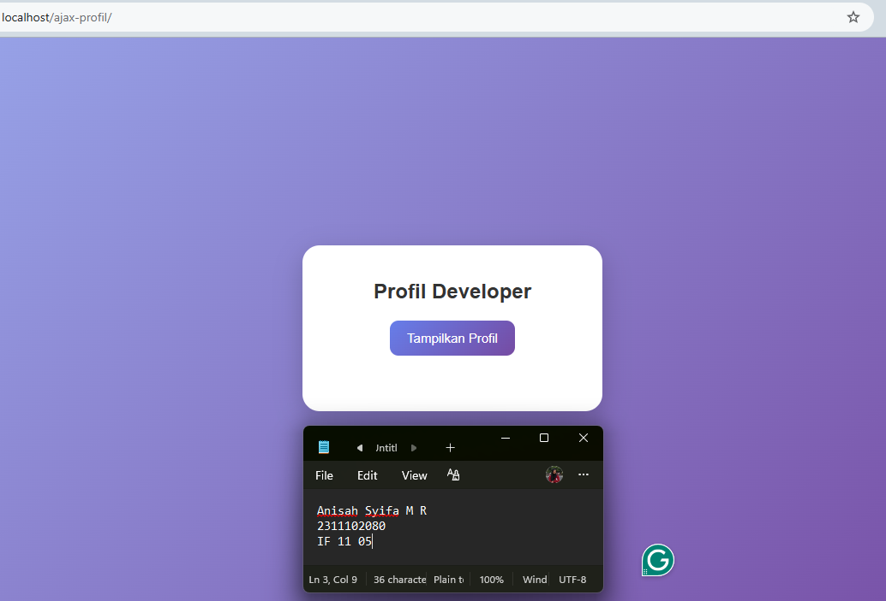
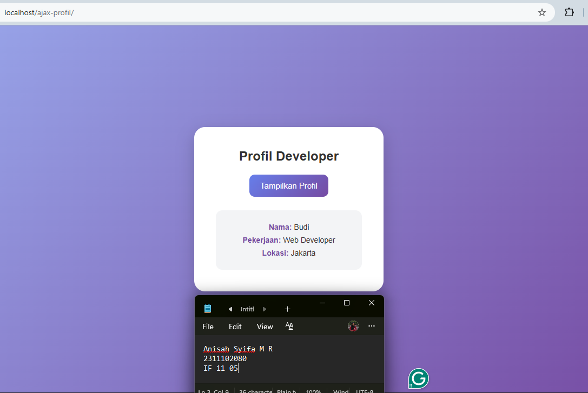

<div align="center">
  <br />
  <h1>LAPORAN PRAKTIKUM <br> APLIKASI BERBASIS PLATFORM </h1>
  <br />
  <h3>MODUL 10 <br> AJAX </h3>
  <br />
  
  <br />
  <br />
  <br />
  <h3>Disusun Oleh :</h3>
  <p>
    <strong>Anisah Syifa Mustika Riyanto</strong>
    <br>
    <strong>2311102080</strong>
    <br>
    <strong>S1 IF-11-05</strong>
  </p>
  <br />
  <h3>Dosen Pengampu :</h3>
  <p>
    <strong>Dedi Agung Prabowo, S.Kom., M.Kom</strong>
  </p>
  <br />
  <br />
  <h4>Asisten Praktikum :</h4>
  <strong>Apri Pandu Wicaksono </strong>
  <br>
  <strong>Hamka Zaenul Ardi</strong>
  <br />
  <h3>LABORATORIUM HIGH PERFORMANCE <br>FAKULTAS INFORMATIKA <br>UNIVERSITAS TELKOM PURWOKERTO <br>2026</h3>
</div>

<hr>

## Dasar Teori AJAX

### 1. Pengertian AJAX

AJAX (Asynchronous JavaScript and XML) merupakan teknik dalam pengembangan web yang digunakan untuk mengambil dan mengirim data ke server secara asynchronous tanpa perlu melakukan reload halaman secara keseluruhan. Dengan AJAX, halaman web dapat diperbarui sebagian sehingga meningkatkan kecepatan dan kenyamanan pengguna.

### 2. Konsep Kerja AJAX

AJAX bekerja dengan memanfaatkan JavaScript sebagai perantara antara client (browser) dan server. Ketika pengguna melakukan suatu aksi, seperti menekan tombol, JavaScript akan mengirim permintaan (request) ke server. Server kemudian memproses permintaan tersebut dan mengirimkan respon kembali ke client dalam format tertentu, seperti JSON. Selanjutnya, JavaScript akan menampilkan data tersebut ke halaman web tanpa memuat ulang halaman.

### 3. Komponen AJAX

AJAX terdiri dari beberapa komponen utama, yaitu:

- HTML dan CSS → untuk menampilkan dan mendesain halaman
- JavaScript → untuk mengatur logika dan komunikasi dengan server
- XMLHttpRequest / Fetch API → untuk melakukan request ke server
- Server (misalnya PHP) → untuk memproses dan menyediakan data
- Format data (JSON/XML) → sebagai media pertukaran data

### 4. Fetch API dalam AJAX

Pada implementasi modern, AJAX umumnya menggunakan Fetch API dari JavaScript. Fetch API digunakan untuk mengambil data dari server dengan sintaks yang lebih sederhana dibandingkan metode lama seperti XMLHttpRequest. Data yang diterima biasanya dalam format JSON, kemudian diproses dan ditampilkan ke dalam halaman web.

### 5. Keunggulan AJAX

Beberapa keunggulan penggunaan AJAX antara lain:

- Tidak perlu reload halaman secara keseluruhan
- Proses pertukaran data lebih cepat
- Mengurangi beban server dan bandwidth
- Meningkatkan pengalaman pengguna (user experience)

### 6. Kelemahan AJAX

Selain keunggulan, AJAX juga memiliki beberapa kelemahan, yaitu:

- Membutuhkan pemahaman JavaScript yang baik
- Tidak semua browser lama mendukung fitur AJAX secara penuh
- Proses debugging bisa lebih kompleks

## Tugas 10 - AJAX

### Source Code - data.php

```
<?php
header('Content-Type: application/json');

// Data (array asosiatif)
$data = [
    "nama" => "Budi",
    "pekerjaan" => "Web Developer",
    "lokasi" => "Jakarta"
];

// Ubah ke JSON dan tampilkan
echo json_encode($data);
?>
```

### Source Code - index.html

```
<!doctype html>
<html>
  <head>
    <meta charset="UTF-8" />
    <title>AJAX Profil</title>

    <style>
      * {
        margin: 0;
        padding: 0;
        box-sizing: border-box;
        font-family: "Poppins", sans-serif;
      }

      body {
        height: 100vh;
        background: linear-gradient(135deg, #99a8ec, #764ba2);
        display: flex;
        justify-content: center;
        align-items: center;
      }

      .card {
        background: white;
        padding: 40px;
        border-radius: 20px;
        width: 350px;
        text-align: center;
        box-shadow: 0 10px 30px rgba(0, 0, 0, 0.2);
      }

      h2 {
        margin-bottom: 20px;
        color: #333;
      }

      button {
        background: linear-gradient(135deg, #667eea, #764ba2);
        color: white;
        border: none;
        padding: 12px 20px;
        border-radius: 10px;
        font-size: 15px;
        cursor: pointer;
        transition: 0.3s;
      }

      button:hover {
        transform: scale(1.05);
        opacity: 0.9;
      }

      #hasil-profil {
        margin-top: 25px;
      }

      .result {
        margin-top: 15px;
        padding: 15px;
        border-radius: 12px;
        background: #f3f4f6;
        animation: fadeIn 0.4s ease-in-out;
      }

      .item {
        margin: 8px 0;
        font-size: 14px;
        color: #333;
      }

      .label {
        font-weight: bold;
        color: #764ba2;
      }

      .loading {
        margin-top: 15px;
        color: #888;
        font-style: italic;
      }

      @keyframes fadeIn {
        from {
          opacity: 0;
          transform: translateY(10px);
        }
        to {
          opacity: 1;
          transform: translateY(0);
        }
      }
    </style>
  </head>

  <body>
    <div class="card">
      <h2>Profil Developer</h2>

      <button onclick="ambilData()">Tampilkan Profil</button>

      <div id="hasil-profil"></div>
    </div>

    <script>
      function ambilData() {
        const hasil = document.getElementById("hasil-profil");

        // Loading dulu
        hasil.innerHTML = '<p class="loading">Loading...</p>';

        fetch("data.php")
          .then((response) => response.json())
          .then((data) => {
            hasil.innerHTML = `
                <div class="result">
                    <div class="item"><span class="label">Nama:</span> ${data.nama}</div>
                    <div class="item"><span class="label">Pekerjaan:</span> ${data.pekerjaan}</div>
                    <div class="item"><span class="label">Lokasi:</span> ${data.lokasi}</div>
                </div>
            `;
          })
          .catch(() => {
            hasil.innerHTML = '<p class="loading">Gagal mengambil data 😢</p>';
          });
      }
    </script>
  </body>
</html>
```

### Hasil Output





### Deskripsi Kode

Program ini terdiri dari dua bagian utama, yaitu file index.html sebagai sisi client (tampilan) dan data.php sebagai sisi server (penyedia data). Program dibuat menggunakan kombinasi HTML, CSS, JavaScript, dan PHP untuk mengimplementasikan konsep AJAX.

Pada file data.php, program diawali dengan penulisan header('Content-Type: application/json'); yang berfungsi untuk memberi tahu browser bahwa data yang dikirim memiliki format JSON. Selanjutnya dibuat sebuah variabel $data dalam bentuk array asosiatif yang berisi informasi profil, seperti nama, pekerjaan, dan lokasi. Data tersebut kemudian diubah ke dalam format JSON menggunakan fungsi json_encode() dan ditampilkan menggunakan echo, sehingga dapat diakses oleh client.

Pada file index.html, bagian awal berisi struktur dasar HTML serta elemen `<meta charset="UTF-8">` untuk memastikan karakter ditampilkan dengan benar. Selanjutnya terdapat bagian `<style>` yang digunakan untuk mempercantik tampilan halaman, seperti pengaturan background gradasi, tampilan card, tombol, serta animasi sederhana agar halaman terlihat lebih modern dan menarik.

Pada bagian `<body>`, terdapat sebuah container berbentuk card yang berisi judul, tombol “Tampilkan Profil”, dan sebuah `<div>` dengan id hasil-profil yang berfungsi sebagai tempat menampilkan data yang diambil dari server. Tombol tersebut memiliki event onclick yang akan menjalankan fungsi JavaScript bernama ambilData() ketika diklik.

Fungsi ambilData() merupakan inti dari proses AJAX. Saat tombol diklik, program terlebih dahulu menampilkan teks “Loading...” sebagai indikator proses pengambilan data. Kemudian digunakan fungsi fetch("data.php") dari JavaScript untuk mengirim permintaan ke server tanpa melakukan reload halaman. Setelah data diterima, response diubah menjadi format JSON menggunakan .then(response => response.json()).

Selanjutnya, data yang diterima akan ditampilkan ke dalam elemen hasil-profil dengan memanfaatkan innerHTML. Data ditampilkan dalam bentuk elemen HTML yang sudah diberi styling, seperti nama, pekerjaan, dan lokasi yang ditampilkan secara terstruktur. Selain itu, program juga menyediakan penanganan error menggunakan .catch() untuk menampilkan pesan jika terjadi kegagalan dalam mengambil data.
