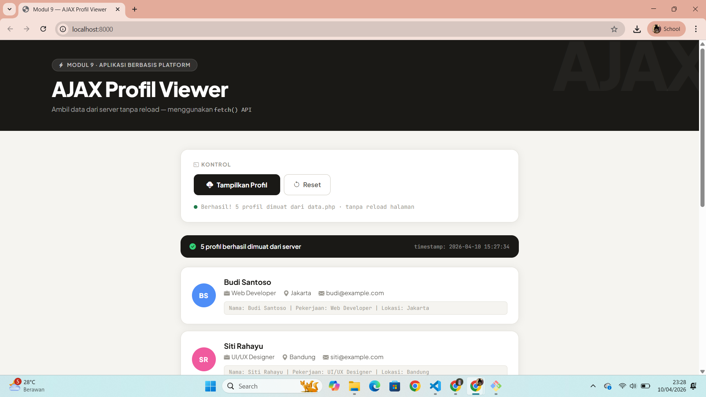

<div align="center">
  <br />
  <h1>LAPORAN PRAKTIKUM <br> APLIKASI BERBASIS PLATFORM </h1>
  <br />
  <h3>MODUL 9 <br> AJAX (Asynchronous JavaScript and XML) </h3>
  <br />
  
  <br />
  <br />
  <br />
  <h3>Disusun Oleh :</h3>
  <p>
    <strong>Ahmad Tegar Kahfi Asyngarinanto</strong>
    <br>
    <strong>2311102083</strong>
    <br>
    <strong>S1 IF-11-REG05</strong>
  </p>
  <br />
  <h3>Dosen Pengampu :</h3>
  <p>
    <strong>Dedi Agung Prabowo, S.Kom., M.Kom</strong>
  </p>
  <br />
  <br />
  <h4>Asisten Praktikum :</h4>
  <strong>Apri Pandu Wicaksono</strong>
  <br>
  <strong>Hamka Zaenul Ardi</strong>
  <br />
  <h3>LABORATORIUM HIGH PERFORMANCE <br>FAKULTAS INFORMATIKA <br>UNIVERSITAS TELKOM PURWOKERTO <br>2026 </h3>
</div>

<hr>

# Dasar Teori

## 1. AJAX (Asynchronous JavaScript and XML)

AJAX adalah teknik pemrograman web yang memungkinkan halaman web untuk berkomunikasi dengan server dan memperbarui konten **tanpa perlu melakukan reload/refresh halaman** secara keseluruhan. Walaupun namanya menyebut "XML", dalam praktik modern data yang digunakan umumnya berformat **JSON**.

Sebelum AJAX, setiap kali pengguna menginginkan data baru dari server, browser harus memuat ulang seluruh halaman. Dengan AJAX, hanya bagian tertentu dari halaman yang diperbarui secara dinamis, sehingga pengalaman pengguna menjadi jauh lebih cepat dan mulus.

---

## 2. Cara Kerja AJAX

Alur kerja AJAX secara umum:

```
Browser (Client)          Server
     │                      │
     │──── HTTP Request ────►│  (fetch/XMLHttpRequest)
     │                      │
     │                      │  Proses data (PHP)
     │                      │
     │◄─── HTTP Response ───│  (JSON/XML/HTML)
     │                      │
     │  Update DOM tanpa     │
     │  reload halaman       │
```

1. Pengguna melakukan aksi (misalnya klik tombol)
2. JavaScript mengirim request HTTP ke server secara **asinkron** (tidak memblokir halaman)
3. Server memproses request dan mengembalikan data (biasanya JSON)
4. JavaScript menerima response dan memperbarui DOM sesuai data yang diterima

---

## 3. fetch() API

`fetch()` adalah API JavaScript modern (ES2015+) untuk melakukan HTTP request. Ia berbasis **Promise**, sehingga penanganan operasi asinkron menjadi lebih bersih dibanding cara lama (`XMLHttpRequest`).

### Sintaks Dasar

```javascript
fetch('data.php')
  .then(function(response) {
    // Cek apakah HTTP response sukses (status 200-299)
    if (!response.ok) {
      throw new Error('HTTP error: ' + response.status);
    }
    // Parse body response sebagai JSON
    return response.json();
  })
  .then(function(data) {
    // Gunakan data yang sudah diparse
    console.log(data);
  })
  .catch(function(error) {
    // Tangani error (network error, parse error, dll)
    console.error('Terjadi kesalahan:', error);
  });
```

### Perbandingan fetch() vs XMLHttpRequest

| Aspek | `fetch()` | `XMLHttpRequest` |
|-------|-----------|-----------------|
| Sintaks | Modern, berbasis Promise | Lebih verbose, callback-based |
| Penanganan error | `.catch()` | Event `onerror` |
| Browser support | Semua browser modern | Semua browser (termasuk lama) |
| Response parsing | `.json()`, `.text()` | `responseText` manual |
| Kemudahan | Lebih mudah dibaca | Lebih kompleks |

---

## 4. Promise dan Rantai `.then()`

`fetch()` mengembalikan sebuah **Promise** — yaitu objek yang merepresentasikan operasi asinkron yang mungkin belum selesai.

```javascript
// Promise memiliki 3 state:
// - Pending  : operasi sedang berjalan
// - Fulfilled: operasi selesai dengan sukses → .then()
// - Rejected : operasi gagal → .catch()

fetch('data.php')           // Mengembalikan Promise<Response>
  .then(res => res.json())  // Mengembalikan Promise<Object>
  .then(data => {           // data sudah berupa JavaScript Object
    tampilkanData(data);
  })
  .catch(err => {           // Menangkap error dari .then() manapun
    console.error(err);
  })
  .finally(() => {          // Selalu dijalankan, berhasil maupun gagal
    hideLoading();
  });
```

---

## 5. JSON di PHP

Di sisi server, PHP menggunakan `json_encode()` untuk mengubah array PHP menjadi string JSON, dan `json_decode()` untuk kebalikannya.

```php
<?php
// Wajib: beritahu browser bahwa response adalah JSON
header('Content-Type: application/json');

// Data sebagai array asosiatif PHP
$data = [
    ['nama' => 'Budi', 'pekerjaan' => 'Web Developer', 'lokasi' => 'Jakarta'],
    ['nama' => 'Siti', 'pekerjaan' => 'Designer',      'lokasi' => 'Bandung']
];

// Encode ke JSON dan tampilkan
echo json_encode($data);
?>
```

**Output:**
```json
[
  {"nama":"Budi","pekerjaan":"Web Developer","lokasi":"Jakarta"},
  {"nama":"Siti","pekerjaan":"Designer","lokasi":"Bandung"}
]
```

### Flag penting `json_encode()`

| Flag | Fungsi |
|------|--------|
| `JSON_PRETTY_PRINT` | Output JSON diformat rapi (baris & indentasi) |
| `JSON_UNESCAPED_UNICODE` | Karakter Unicode (huruf non-ASCII) tidak di-escape |

---

## 6. DOM Manipulation via JavaScript

Setelah data JSON diterima, JavaScript memanipulasi DOM untuk menampilkan data tanpa reload:

```javascript
fetch('data.php')
  .then(res => res.json())
  .then(data => {
    const container = document.getElementById('hasil-profil');

    // Buat HTML dari data dan masukkan ke DOM
    let html = '';
    data.forEach(p => {
      html += `<p>Nama: ${p.nama} | Pekerjaan: ${p.pekerjaan} | Lokasi: ${p.lokasi}</p>`;
    });

    container.innerHTML = html;
  });
```

---

# Tugas 9 — AJAX Profil Viewer

## Deskripsi

Halaman web yang mengambil data profil dari server (`data.php`) secara asinkron menggunakan `fetch()`, lalu menampilkannya ke dalam halaman **tanpa reload**. Dilengkapi dengan loading skeleton, network activity log, dan status indicator.

## Struktur File

```
modul9-ajax/
├── data.php     # Server PHP — mengembalikan data JSON
└── index.html   # Client — halaman dengan tombol & logika AJAX
```

## Cara Menjalankan

> **Wajib dijalankan di web server lokal** karena `fetch()` ke file PHP memerlukan server PHP aktif.

### Menggunakan XAMPP / Laragon

1. Copy folder `modul9-ajax/` ke dalam `htdocs/` (XAMPP) atau `www/` (Laragon)
2. Pastikan Apache & PHP aktif
3. Buka browser: `http://localhost/modul9-ajax/`

### Menggunakan PHP Built-in Server

```bash
cd modul9-ajax
php -S localhost:8000
# Buka: http://localhost:8000
```

## Code

### data.php

```php
<?php
header('Content-Type: application/json');
header('Access-Control-Allow-Origin: *');

$profiles = [
    ['nama' => 'Budi Santoso',  'pekerjaan' => 'Web Developer',   'lokasi' => 'Jakarta'],
    ['nama' => 'Siti Rahayu',   'pekerjaan' => 'UI/UX Designer',  'lokasi' => 'Bandung'],
    ['nama' => 'Ahmad Fauzi',   'pekerjaan' => 'Data Scientist',   'lokasi' => 'Surabaya'],
    ['nama' => 'Dewi Lestari',  'pekerjaan' => 'Product Manager',  'lokasi' => 'Yogyakarta'],
    ['nama' => 'Rizky Pratama', 'pekerjaan' => 'DevOps Engineer',  'lokasi' => 'Medan']
];

echo json_encode([
    'success'   => true,
    'total'     => count($profiles),
    'data'      => $profiles,
    'timestamp' => date('Y-m-d H:i:s')
], JSON_PRETTY_PRINT | JSON_UNESCAPED_UNICODE);
?>
```

### index.html — Logika AJAX

```javascript
document.getElementById('btnTampilkan').addEventListener('click', function () {
  const container = document.getElementById('hasil-profil');

  // Kirim request ke data.php menggunakan fetch()
  fetch('data.php')
    .then(function(response) {
      if (!response.ok) throw new Error('HTTP error: ' + response.status);
      return response.json();  // Parse JSON
    })
    .then(function(data) {
      // Tampilkan data ke DOM — tanpa reload halaman
      let html = '';
      data.data.forEach(p => {
        html += `<p>Nama: ${p.nama} | Pekerjaan: ${p.pekerjaan} | Lokasi: ${p.lokasi}</p>`;
      });
      container.innerHTML = html;
    })
    .catch(function(error) {
      container.innerHTML = '<p>Error: ' + error.message + '</p>';
    });
});
```

## Output


