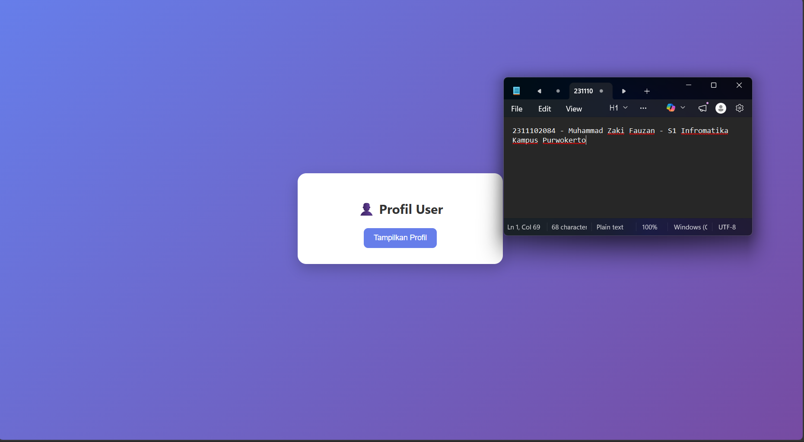
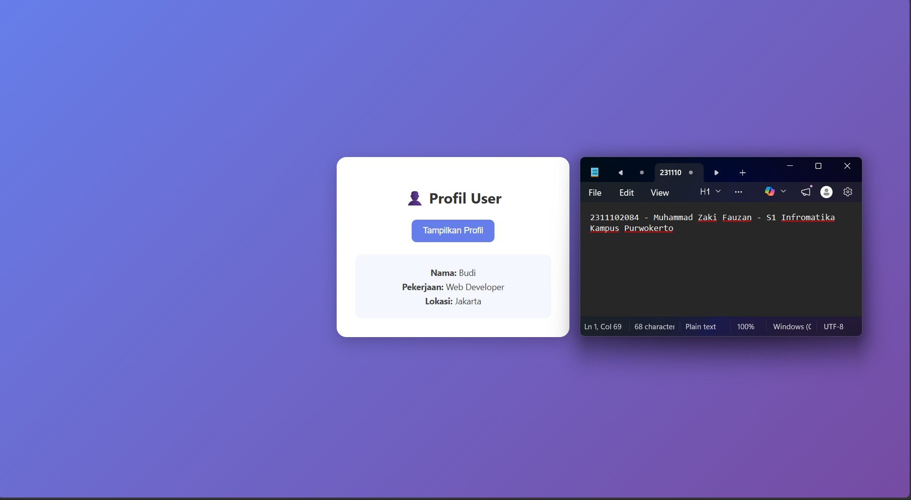

<div align="center">
    <br />
    <h1>LAPORAN PRAKTIKUM <br> APLIKASI BERBASIS PLATFORM </h1>
    <br />
    <h3>MODUL 10 <br> AJAX </h3>
    <br />
    
    <br />
    <br />
    <br />
    <h3>Disusun Oleh :</h3>
    <p>
        <strong>Muhammad Zaki Fauzan</strong>
        <br>
        <strong>2311102084</strong>
        <br>
        <strong>S1 IF-11-REG05</strong>
    </p>
    <br />
    <h3>Dosen Pengampu :</h3>
    <p>
        <strong>Dedi Agung Prabowo, S.Kom., M.Kom</strong>
    </p>
    <br />
    <br />
    <h4>Asisten Praktikum :</h4>
    <strong>Apri Pandu Wicaksono </strong>
    <br>
    <strong>Hamka Zaenul Ardi</strong>
    <br />
    <h3>LABORATORIUM HIGH PERFORMANCE <br>FAKULTAS INFORMATIKA <br>UNIVERSITAS TELKOM PURWOKERTO <br>2026 </h3>
</div>
<hr>

## Dasar Teori

AJAX (Asynchronous JavaScript and XML) adalah teknik dalam pengembangan web yang memungkinkan pertukaran data antara client dan server secara asynchronous tanpa perlu melakukan reload halaman. Dengan memanfaatkan JavaScript (seperti fetch()), data dapat diambil dari server dalam format JSON, kemudian diproses dan ditampilkan secara dinamis pada halaman web. Penggunaan AJAX meningkatkan efisiensi dan pengalaman pengguna karena interaksi menjadi lebih cepat dan responsif.

## Tugas Modul 10 - AJAX

### Source Code

```php
<?php
header('Content-Type: application/json');

$data = [
    'nama' => 'Budi',
    'pekerjaan' => 'Web Developer',
    'lokasi' => 'Jakarta'
];

echo json_encode($data);
?>
```

**Kode Lengkap:** [data.php](data.php)

```html
<!DOCTYPE html>
<html lang="id">
<head>
    <meta charset="UTF-8">
    <title>Profil User</title>

    <style>
        body {
            font-family: 'Segoe UI', sans-serif;
            background: linear-gradient(135deg, #667eea, #764ba2);
            height: 100vh;
            display: flex;
            justify-content: center;
            align-items: center;
            margin: 0;
        }
```

**Kode Lengkap:** [index.html](index.html)

Output:

**before click button**


**After click button**


### Penjelasan

Setelah tombol “Tampilkan Profil” diklik, sistem akan menjalankan fungsi JavaScript yang menggunakan fetch() untuk mengambil data dari file data.php. Data yang dikirim oleh server dalam format JSON kemudian diubah menjadi objek JavaScript. Selanjutnya, data tersebut ditampilkan ke dalam elemen <div id="hasil-profil"> tanpa perlu melakukan reload halaman. Hasil output yang muncul berupa informasi profil yaitu nama, pekerjaan, dan lokasi sesuai dengan data yang telah disediakan pada server.