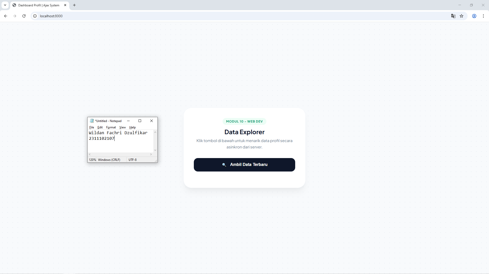

<div align="center">
    <br />
    <h1>LAPORAN PRAKTIKUM <br> APLIKASI BERBASIS PLATFORM </h1>
    <br />
    <h3>MODUL 10 <br> AJAX </h3>
    <br />
    
    <br />
    <br />
    <br />
    <h3>Disusun Oleh :</h3>
    <p>
        <strong>Wildan Fachri Dzulfikar</strong>
        <br>
        <strong>2311102107</strong>
        <br>
        <strong>S1 IF-11-REG05</strong>
    </p>
    <br />
    <h3>Dosen Pengampu :</h3>
    <p>
        <strong>Dedi Agung Prabowo, S.Kom., M.Kom</strong>
    </p>
    <br />
    <br />
    <h4>Asisten Praktikum :</h4>
    <strong>Apri Pandu Wicaksono </strong>
    <br>
    <strong>Hamka Zaenul Ardi</strong>
    <br />
    <h3>LABORATORIUM HIGH PERFORMANCE <br>FAKULTAS INFORMATIKA <br>UNIVERSITAS TELKOM PURWOKERTO <br>2026 </h3>
</div>
<hr>

## Dasar Teori

AJAX, atau singkatan dari Asynchronous JavaScript and XML, adalah sekumpulan teknik pengembangan web yang memungkinkan halaman web untuk berkomunikasi dengan server secara asinkron. Hal ini berarti aplikasi dapat mengirim dan mengambil data dari server di latar belakang tanpa harus melakukan pemuatan ulang (reload) pada keseluruhan halaman. Dengan AJAX, interaksi pengguna menjadi lebih cepat dan responsif karena hanya bagian tertentu dari antarmuka saja yang diperbarui.

Secara teknis, mekanisme AJAX bekerja dengan memanfaatkan objek XMLHttpRequest (pada metode lama) atau Fetch API (pada standar modern) yang disediakan oleh browser. Ketika terjadi sebuah aksi—seperti klik tombol—JavaScript akan membuat permintaan (request) ke server. Server kemudian memproses permintaan tersebut dan mengembalikan data (biasanya dalam format JSON atau XML). Setelah data diterima, JavaScript akan memanipulasi Document Object Model (DOM) untuk memperbarui konten halaman secara instan.

Keunggulan utama AJAX terletak pada efisiensi penggunaan bandwidth dan peningkatan pengalaman pengguna (User Experience). Karena server tidak perlu mengirimkan kembali seluruh struktur HTML halaman, beban kerja jaringan menjadi lebih ringan. AJAX merupakan fondasi penting dalam pembuatan aplikasi web modern seperti sistem obrolan (chatting), pembaruan skor olahraga secara langsung, hingga fitur pencarian otomatis (autocomplete) yang kita temui di berbagai platform digital saat ini.

## Tugas Modul 10 - AJAX

### Source Code

```php
<?php
header('Content-Type: application/json');

$profil = [
    'nama' => 'Budi',
    'pekerjaan' => 'Web Developer',
    'lokasi' => 'Jakarta'
];

echo json_encode($profil);
```

**Kode Lengkap:** [data.php](data.php)

```html
<!DOCTYPE html>
<html lang="id">
<head>
    <meta charset="UTF-8">
    <meta name="viewport" content="width=device-width, initial-scale=1.0">
    <title>Dashboard Profil | Ajax System</title>
    <style>
        @import url('https://fonts.googleapis.com/css2?family=Plus+Jakarta+Sans:wght@400;500;600;700&display=swap');

        :root {
            --bg-body: #f8fafc;
            --primary: #059669; /* Emerald 600 */
            --primary-hover: #047857;
            --accent: #f59e0b; /* Amber 500 */
            --text-dark: #0f172a;
            --text-light: #64748b;
            --card-white: #ffffff;
        }

        * {
            margin: 0;
            padding: 0;
            box-sizing: border-box;
        }

        body {
            font-family: 'Plus Jakarta Sans', sans-serif;
            background-color: var(--bg-body);
            background-image: radial-gradient(#e2e8f0 1px, transparent 1px);
            background-size: 20px 20px;
            color: var(--text-dark);
            min-height: 100vh;
            display: flex;
            align-items: center;
            justify-content: center;
            padding: 24px;
        }
```

**Kode Lengkap:** [index.html](index.html)

Output:



### Penjelasan

Website Data Explorer yang baru saja diperbarui merupakan aplikasi berbasis web yang menerapkan teknologi AJAX (Asynchronous JavaScript and XML) untuk menciptakan pengalaman pengguna yang lebih mulus dan interaktif. Berbeda dengan website tradisional yang mengharuskan halaman dimuat ulang sepenuhnya setiap kali meminta data, sistem ini bekerja secara "senyap" di latar belakang.