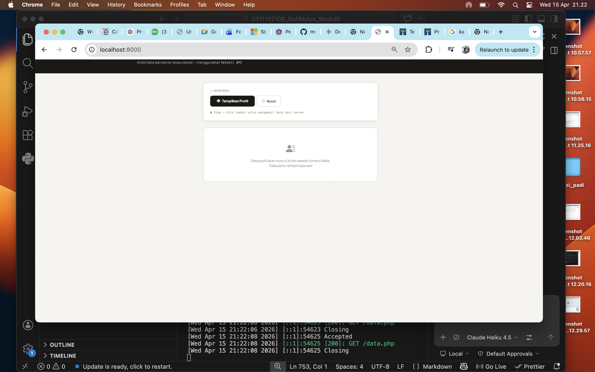
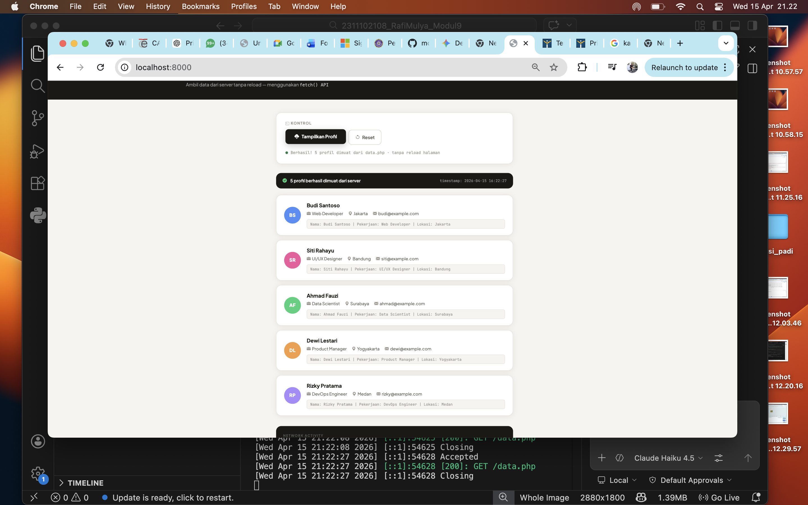

<div align="center">
    <br />
    <h1>LAPORAN PRAKTIKUM <br> APLIKASI BERBASIS PLATFORM </h1>
    <br />
    <h3>MODUL 10 <br> AJAX </h3>
    <br />
    
    <br />
    <br />
    <br />
    <h3>Disusun Oleh :</h3>
    <p>
        <strong>Rafi Mulya Rizqi</strong>
        <br>
        <strong>2311102108</strong>
        <br>
        <strong>S1 IF-11-REG05</strong>
    </p>
    <br />
    <h3>Dosen Pengampu :</h3>
    <p>
        <strong>Dedi Agung Prabowo, S.Kom., M.Kom</strong>
    </p>
    <br />
    <br />
    <h4>Asisten Praktikum :</h4>
    <strong>Apri Pandu Wicaksono </strong>
    <br>
    <strong>Hamka Zaenul Ardi</strong>
    <br />
    <h3>LABORATORIUM HIGH PERFORMANCE <br>FAKULTAS INFORMATIKA <br>UNIVERSITAS TELKOM PURWOKERTO <br>2026 </h3>
</div>
<hr>

## Dasar Teori

AJAX (Asynchronous JavaScript and XML) adalah teknik dalam pengembangan web yang memungkinkan aplikasi melakukan pertukaran data dengan server secara asinkron (tanpa reload halaman). Dengan AJAX, sebagian konten pada halaman web dapat diperbarui secara dinamis tanpa harus memuat ulang seluruh halaman, sehingga meningkatkan performa dan pengalaman pengguna (UX).

AJAX bekerja dengan memanfaatkan objek seperti XMLHttpRequest atau Fetch API untuk mengirim dan menerima data dari server (biasanya dalam format JSON). Teknologi ini sering digunakan pada fitur seperti live search, auto-save, notifikasi real-time, dan form submission tanpa refresh halaman.

## Tugas Modul 10 - AJAX

### Source Code

<?php
// ============================================================
// data.php — Server sederhana: mengembalikan data profil JSON
// Modul 9: AJAX — Aplikasi Berbasis Platform
// ============================================================

// Set header agar browser tahu response ini berformat JSON
header('Content-Type: application/json');

// Izinkan akses dari semua origin (agar fetch dari index.html lokal bisa berjalan)
header('Access-Control-Allow-Origin: *');

// Data profil sebagai array asosiatif PHP
$profiles = [
    [
        'id'         => 1,
        'nama'       => 'Budi Santoso',
        'pekerjaan'  => 'Web Developer',
        'lokasi'     => 'Jakarta',
        'email'      => 'budi@example.com',
        'avatar'     => 'BS',
        'warna'      => '#4f8ef7'
    ],
    [
        'id'         => 2,
        'nama'       => 'Siti Rahayu',
        'pekerjaan'  => 'UI/UX Designer',
        'lokasi'     => 'Bandung',
        'email'      => 'siti@example.com',
        'avatar'     => 'SR',
        'warna'      => '#f05a9e'
    ],
    [
        'id'         => 3,
        'nama'       => 'Ahmad Fauzi',
        'pekerjaan'  => 'Data Scientist',
        'lokasi'     => 'Surabaya',
        'email'      => 'ahmad@example.com',
        'avatar'     => 'AF',
        'warna'      => '#34d17a'
    ],
    [
        'id'         => 4,
        'nama'       => 'Dewi Lestari',
        'pekerjaan'  => 'Product Manager',
        'lokasi'     => 'Yogyakarta',
        'email'      => 'dewi@example.com',
        'avatar'     => 'DL',
        'warna'      => '#f59e42'
    ],
    [
        'id'         => 5,
        'nama'       => 'Rizky Pratama',
        'pekerjaan'  => 'DevOps Engineer',
        'lokasi'     => 'Medan',
        'email'      => 'rizky@example.com',
        'avatar'     => 'RP',
        'warna'      => '#a78bfa'
    ]
];

// Bungkus dalam struktur response standar
$response = [
    'success'   => true,
    'message'   => 'Data berhasil diambil',
    'total'     => count($profiles),
    'data'      => $profiles,
    'timestamp' => date('Y-m-d H:i:s')
];

// Encode array PHP menjadi JSON dan tampilkan
echo json_encode($response, JSON_PRETTY_PRINT | JSON_UNESCAPED_UNICODE);
?>

**Kode Lengkap:** [data.php](data.php)

```html
<!DOCTYPE html>
<html lang="id">
<head>
  <meta charset="UTF-8" />
  <meta name="viewport" content="width=device-width, initial-scale=1.0" />
  <title>Modul 9 — AJAX Profil Viewer</title>

  <!-- Google Fonts -->
  <link href="https://fonts.googleapis.com/css2?family=Plus+Jakarta+Sans:wght@300;400;500;600;700;800&family=JetBrains+Mono:wght@400;600&display=swap" rel="stylesheet" />
  <!-- Bootstrap 5 -->
  <link href="https://cdn.jsdelivr.net/npm/bootstrap@5.3.3/dist/css/bootstrap.min.css" rel="stylesheet" />
  <!-- Bootstrap Icons -->
  <link href="https://cdn.jsdelivr.net/npm/bootstrap-icons@1.11.3/font/bootstrap-icons.css" rel="stylesheet" />

  <style>
    /* ===== VARIABLES ===== */
    :root {
      --bg:        #f5f4f0;
      --surface:   #ffffff;
      --border:    #e2e0d8;
      --border-dk: #ccc9be;
      --text-1:    #1a1916;
      --text-2:    #5c5a54;
      --text-3:    #9b9890;
      --accent:    #1a1916;
      --green:     #1f7a4a;
      --red:       #c0392b;
      --radius:    16px;
      --radius-sm: 10px;
      --shadow:    0 2px 16px rgba(0,0,0,0.07);
      --shadow-lg: 0 8px 40px rgba(0,0,0,0.12);
      --font:      'Plus Jakarta Sans', sans-serif;
      --mono:      'JetBrains Mono', monospace;
    }

    *, *::before, *::after { box-sizing: border-box; }

    body {
      font-family: var(--font);
      background: var(--bg);
      color: var(--text-1);
      min-height: 100vh;
      padding: 0;
    }

    /* ===== HEADER ===== */
    .page-header {
      background: var(--accent);
      padding: 40px 0 36px;
      position: relative;
      overflow: hidden;
    }

    .page-header::before {
      content: 'AJAX';
      position: absolute;
      right: -20px; top: -20px;
      font-size: 9rem;
      font-weight: 800;
      color: rgba(255,255,255,0.04);
      letter-spacing: -6px;
      user-select: none;
      line-height: 1;
    }

    .header-chip {
      display: inline-flex;
      align-items: center;
      gap: 6px;
      background: rgba(255,255,255,0.1);
      border: 1px solid rgba(255,255,255,0.15);
      border-radius: 999px;
      padding: 4px 14px;
      font-size: 0.72rem;
      font-weight: 600;
      color: rgba(255,255,255,0.7);
      letter-spacing: 1px;
      text-transform: uppercase;
      margin-bottom: 14px;
    }

    .page-header h1 {
      font-size: clamp(1.8rem, 4vw, 2.8rem);
      font-weight: 800;
      color: #ffffff;
      line-height: 1.1;
      letter-spacing: -1px;
      margin-bottom: 8px;
    }

    .page-header p {
      font-size: 0.9rem;
      color: rgba(255,255,255,0.55);
      margin: 0;
    }

    /* ===== MAIN SECTION ===== */
    .main-wrap { padding: 40px 0 60px; }

    /* ===== CONTROL PANEL ===== */
    .control-panel {
      background: var(--surface);
      border: 1px solid var(--border);
      border-radius: var(--radius);
      padding: 24px 28px;
      margin-bottom: 28px;
      box-shadow: var(--shadow);
    }

    .control-label {
      font-size: 0.72rem;
      font-weight: 700;
      text-transform: uppercase;
      letter-spacing: 1.2px;
      color: var(--text-3);
      margin-bottom: 12px;
    }

    /* ===== TOMBOL FETCH ===== */
    .btn-fetch {
      background: var(--accent);
      color: white;
      border: none;
      padding: 12px 28px;
      border-radius: var(--radius-sm);
      font-family: var(--font);
      font-weight: 700;
      font-size: 0.9rem;
      cursor: pointer;
      display: inline-flex;
      align-items: center;
      gap: 8px;
      transition: all 0.2s;
      position: relative;
      overflow: hidden;
    }

    .btn-fetch::after {
      content: '';
      position: absolute;
      inset: 0;
      background: rgba(255,255,255,0);
      transition: background 0.15s;
    }

    .btn-fetch:hover { transform: translateY(-2px); box-shadow: 0 6px 20px rgba(0,0,0,0.2); }
    .btn-fetch:active { transform: translateY(0); }
    .btn-fetch:disabled { opacity: 0.55; cursor: not-allowed; transform: none; }

    .btn-reset {
      background: transparent;
      color: var(--text-2);
      border: 1px solid var(--border-dk);
      padding: 11px 20px;
      border-radius: var(--radius-sm);
      font-family: var(--font);
      font-weight: 600;
      font-size: 0.88rem;
      cursor: pointer;
      display: inline-flex;
      align-items: center;
      gap: 7px;
      transition: all 0.2s;
    }

    .btn-reset:hover { border-color: var(--accent); color: var(--accent); }

    /* ===== STATUS BAR ===== */
    .status-bar {
      display: flex;
      align-items: center;
      gap: 8px;
      margin-top: 16px;
      font-size: 0.78rem;
      color: var(--text-3);
      font-family: var(--mono);
    }

    .status-dot {
      width: 8px; height: 8px;
      border-radius: 50%;
      background: var(--text-3);
      flex-shrink: 0;
      transition: background 0.3s;
    }

    .status-dot.loading { background: #f59e42; animation: blink 0.8s ease-in-out infinite; }
    .status-dot.success { background: var(--green); }
    .status-dot.error   { background: var(--red); }

    @keyframes blink {
      0%, 100% { opacity: 1; }
      50%       { opacity: 0.3; }
    }

    /* ===== AREA HASIL ===== */
    #hasil-profil { min-height: 80px; }

    /* State: empty / placeholder */
    .state-empty {
      background: var(--surface);
      border: 2px dashed var(--border-dk);
      border-radius: var(--radius);
      padding: 56px 24px;
      text-align: center;
      color: var(--text-3);
    }

    .state-empty i { font-size: 2.5rem; margin-bottom: 12px; display: block; }
    .state-empty p { font-size: 0.88rem; margin: 0; }

    /* State: loading skeleton */
    .skeleton-card {
      background: var(--surface);
      border: 1px solid var(--border);
      border-radius: var(--radius);
      padding: 22px 24px;
      margin-bottom: 14px;
      display: flex;
      align-items: center;
      gap: 18px;
    }

    .sk-circle {
      width: 52px; height: 52px;
      border-radius: 50%;
      background: linear-gradient(90deg, #ece9e0 25%, #f5f3ee 50%, #ece9e0 75%);
      background-size: 200% 100%;
      animation: shimmer 1.4s infinite;
      flex-shrink: 0;
    }

    .sk-line {
      height: 12px;
      border-radius: 6px;
      background: linear-gradient(90deg, #ece9e0 25%, #f5f3ee 50%, #ece9e0 75%);
      background-size: 200% 100%;
      animation: shimmer 1.4s infinite;
      margin-bottom: 8px;
    }

    @keyframes shimmer {
      0%   { background-position: 200% 0; }
      100% { background-position: -200% 0; }
    }

    /* State: error */
    .state-error {
      background: #fff5f5;
      border: 1px solid #fecaca;
      border-radius: var(--radius);
      padding: 24px 28px;
      color: var(--red);
      display: flex;
      align-items: flex-start;
      gap: 14px;
    }

    .state-error i { font-size: 1.4rem; flex-shrink: 0; margin-top: 2px; }

    /* ===== PROFIL CARD ===== */
    .profile-card {
      background: var(--surface);
      border: 1px solid var(--border);
      border-radius: var(--radius);
      padding: 20px 24px;
      margin-bottom: 14px;
      display: flex;
      align-items: center;
      gap: 18px;
      box-shadow: var(--shadow);
      transition: transform 0.2s, box-shadow 0.2s;
      animation: slideIn 0.35s ease both;
    }

    @keyframes slideIn {
      from { opacity: 0; transform: translateY(16px); }
      to   { opacity: 1; transform: translateY(0); }
    }

    .profile-card:hover { transform: translateY(-2px); box-shadow: var(--shadow-lg); }

    /* Stagger animation */
    .profile-card:nth-child(1) { animation-delay: 0.05s; }
    .profile-card:nth-child(2) { animation-delay: 0.12s; }
    .profile-card:nth-child(3) { animation-delay: 0.19s; }
    .profile-card:nth-child(4) { animation-delay: 0.26s; }
    .profile-card:nth-child(5) { animation-delay: 0.33s; }

    .profile-avatar {
      width: 52px; height: 52px;
      border-radius: 50%;
      display: flex; align-items: center; justify-content: center;
      font-weight: 800;
      font-size: 0.9rem;
      color: white;
      flex-shrink: 0;
      letter-spacing: 0.5px;
    }

    .profile-info { flex: 1; min-width: 0; }

    .profile-nama {
      font-weight: 700;
      font-size: 1rem;
      color: var(--text-1);
      margin-bottom: 3px;
      white-space: nowrap;
      overflow: hidden;
      text-overflow: ellipsis;
    }

    .profile-detail {
      font-size: 0.82rem;
      color: var(--text-2);
      display: flex;
      flex-wrap: wrap;
      gap: 0 16px;
    }

    .profile-detail span {
      display: inline-flex;
      align-items: center;
      gap: 4px;
    }

    .profile-detail i { color: var(--text-3); font-size: 0.78rem; }

    /* Teks format yang diminta tugas */
    .profile-raw {
      margin-top: 8px;
      font-family: var(--mono);
      font-size: 0.72rem;
      color: var(--text-3);
      background: var(--bg);
      border: 1px solid var(--border);
      border-radius: 6px;
      padding: 5px 10px;
      white-space: nowrap;
      overflow: hidden;
      text-overflow: ellipsis;
    }

    /* ===== SUMMARY STRIP ===== */
    .summary-strip {
      background: var(--accent);
      color: white;
      border-radius: var(--radius);
      padding: 14px 20px;
      margin-bottom: 20px;
      display: flex;
      align-items: center;
      justify-content: space-between;
      flex-wrap: wrap;
      gap: 8px;
      animation: slideIn 0.3s ease;
    }

    .summary-strip .s-left { font-size: 0.85rem; font-weight: 600; }
    .summary-strip .s-right { font-family: var(--mono); font-size: 0.72rem; color: rgba(255,255,255,0.5); }

    /* ===== NETWORK LOG ===== */
    .network-log {
      background: #1a1916;
      border-radius: var(--radius);
      padding: 20px 22px;
      font-family: var(--mono);
      font-size: 0.75rem;
      color: #a0a0a0;
      margin-top: 32px;
      line-height: 1.8;
    }

    .network-log .log-title {
      font-size: 0.65rem;
      text-transform: uppercase;
      letter-spacing: 1.5px;
      color: #555;
      margin-bottom: 10px;
      font-family: var(--font);
      font-weight: 700;
    }

    .log-line { display: flex; gap: 12px; }
    .log-time { color: #555; flex-shrink: 0; }
    .log-method { color: #4f8ef7; flex-shrink: 0; }
    .log-url { color: #f59e42; flex: 1; white-space: nowrap; overflow: hidden; text-overflow: ellipsis; }
    .log-status-ok { color: #34d17a; }
    .log-status-err { color: #f05a5a; }
    .log-msg { color: #a0a0a0; }

    /* ===== RESPONSIVE ===== */
    @media (max-width: 576px) {
      .profile-card { flex-direction: column; align-items: flex-start; }
      .profile-detail { flex-direction: column; gap: 2px; }
      .profile-raw { font-size: 0.65rem; }
    }
  </style>
</head>
<body>

  <!-- ===== HEADER ===== -->
  <header class="page-header">
    <div class="container">
      <div class="header-chip">
        <i class="bi bi-lightning-charge-fill"></i>
        Modul 9 · Aplikasi Berbasis Platform
      </div>
      <h1>AJAX Profil Viewer</h1>
      <p>Ambil data dari server tanpa reload — menggunakan <code style="color:rgba(255,255,255,0.7); font-size:0.85rem;">fetch() API</code></p>
    </div>
  </header>

  <!-- ===== MAIN ===== -->
  <div class="main-wrap">
    <div class="container" style="max-width: 760px;">

      <!-- Control Panel -->
      <div class="control-panel">
        <div class="control-label"><i class="bi bi-terminal me-1"></i>Kontrol</div>
        <div class="d-flex gap-2 flex-wrap">
          <button class="btn-fetch" id="btnTampilkan">
            <i class="bi bi-cloud-download-fill"></i>
            Tampilkan Profil
          </button>
          <button class="btn-reset" id="btnReset" disabled>
            <i class="bi bi-arrow-counterclockwise"></i>
            Reset
          </button>
        </div>

        <!-- Status Bar -->
        <div class="status-bar">
          <div class="status-dot" id="statusDot"></div>
          <span id="statusText">Siap — klik tombol untuk mengambil data dari server</span>
        </div>
      </div>

      <!-- Area Hasil -->
      <div id="hasil-profil">
        <div class="state-empty">
          <i class="bi bi-person-lines-fill"></i>
          <p>Data profil akan muncul di sini setelah tombol diklik.<br>Tidak perlu refresh halaman!</p>
        </div>
      </div>

      <!-- Network Log -->
      <div class="network-log" id="networkLog" style="display:none;">
        <div class="log-title">Network Activity</div>
        <div id="logLines"></div>
      </div>

    </div>
  </div>

  <!-- Bootstrap JS -->
  <script src="https://cdn.jsdelivr.net/npm/bootstrap@5.3.3/dist/js/bootstrap.bundle.min.js"></script>

  <script>
    /* ============================================================
       MODUL 9 — AJAX dengan fetch() API
       ============================================================ */

    const btnTampilkan = document.getElementById('btnTampilkan');
    const btnReset     = document.getElementById('btnReset');
    const hasilProfil  = document.getElementById('hasil-profil');
    const statusDot    = document.getElementById('statusDot');
    const statusText   = document.getElementById('statusText');
    const networkLog   = document.getElementById('networkLog');
    const logLines     = document.getElementById('logLines');

    /* ---- Helper: set status bar ---- */
    function setStatus(state, msg) {
      statusDot.className = 'status-dot ' + state;
      statusText.textContent = msg;
    }

    /* ---- Helper: waktu sekarang ---- */
    function nowTime() {
      return new Date().toLocaleTimeString('id-ID', { hour12: false });
    }

    /* ---- Helper: tambah baris log ---- */
    function addLog(method, url, status, msg) {
      networkLog.style.display = 'block';
      const cls = status >= 200 && status < 300 ? 'log-status-ok' : 'log-status-err';
      const line = document.createElement('div');
      line.className = 'log-line';
      line.innerHTML = `
        <span class="log-time">[${nowTime()}]</span>
        <span class="log-method">${method}</span>
        <span class="log-url">${url}</span>
        <span class="${cls}">${status}</span>
        <span class="log-msg">${msg}</span>
      `;
      logLines.appendChild(line);
    }

    /* ---- Render skeleton loading ---- */
    function renderSkeleton() {
      let html = '';
      for (let i = 0; i < 5; i++) {
        html += `
          <div class="skeleton-card">
            <div class="sk-circle"></div>
            <div style="flex:1;">
              <div class="sk-line" style="width:${40 + Math.random()*30}%;"></div>
              <div class="sk-line" style="width:${50 + Math.random()*30}%; height:10px; opacity:0.6;"></div>
            </div>
          </div>`;
      }
      hasilProfil.innerHTML = html;
    }

    /* ---- Render error ---- */
    function renderError(msg) {
      hasilProfil.innerHTML = `
        <div class="state-error">
          <i class="bi bi-exclamation-circle-fill"></i>
          <div>
            <strong>Gagal mengambil data</strong><br>
            <span style="font-size:0.85rem;">${msg}</span>
          </div>
        </div>`;
    }

    /* ---- Render profil cards ---- */
    function renderProfiles(data, timestamp) {
      let html = `
        <div class="summary-strip">
          <div class="s-left">
            <i class="bi bi-check-circle-fill me-2" style="color:#34d17a;"></i>
            ${data.total} profil berhasil dimuat dari server
          </div>
          <div class="s-right">timestamp: ${timestamp}</div>
        </div>`;

      data.data.forEach(p => {
        // Format teks seperti yang diminta tugas
        const rawText = `Nama: ${p.nama} | Pekerjaan: ${p.pekerjaan} | Lokasi: ${p.lokasi}`;

        html += `
          <div class="profile-card">
            <div class="profile-avatar" style="background-color:${p.warna};">${p.avatar}</div>
            <div class="profile-info">
              <div class="profile-nama">${p.nama}</div>
              <div class="profile-detail">
                <span><i class="bi bi-briefcase-fill"></i> ${p.pekerjaan}</span>
                <span><i class="bi bi-geo-alt-fill"></i> ${p.lokasi}</span>
                <span><i class="bi bi-envelope-fill"></i> ${p.email}</span>
              </div>
              <div class="profile-raw">${rawText}</div>
            </div>
          </div>`;
      });

      hasilProfil.innerHTML = html;
    }

    /* ============================================================
       EVENT: Klik "Tampilkan Profil"
       — Menggunakan fetch() untuk AJAX request ke data.php
       ============================================================ */
    btnTampilkan.addEventListener('click', function () {
      // 1. UI: set loading state
      btnTampilkan.disabled = true;
      btnReset.disabled = true;
      setStatus('loading', 'Mengambil data dari server...');
      renderSkeleton();

      const url = 'data.php';
      const startTime = Date.now();

      // 2. Kirim AJAX request menggunakan fetch()
      fetch(url)
        .then(function (response) {
          const elapsed = Date.now() - startTime;

          // 3. Cek apakah response HTTP OK (status 200-299)
          if (!response.ok) {
            addLog('GET', url, response.status, `Error HTTP (${elapsed}ms)`);
            throw new Error(`HTTP error: status ${response.status}`);
          }

          addLog('GET', url, response.status, `OK · ${elapsed}ms`);

          // 4. Parse response body sebagai JSON
          return response.json();
        })
        .then(function (data) {
          // 5. Tampilkan data ke DOM
          if (data.success) {
            renderProfiles(data, data.timestamp);
            setStatus('success', `Berhasil! ${data.total} profil dimuat dari ${url} · tanpa reload halaman`);
            addLog('→', 'parse JSON', 200, `${data.total} objek diterima`);
          } else {
            throw new Error(data.message || 'Server mengembalikan error');
          }
        })
        .catch(function (error) {
          // 6. Tangani error (network error, parse error, dll)
          renderError(error.message);
          setStatus('error', 'Gagal: ' + error.message);
          addLog('GET', url, 0, 'FAILED — ' + error.message);
        })
        .finally(function () {
          // 7. Selalu jalankan: aktifkan tombol kembali
          btnTampilkan.disabled = false;
          btnReset.disabled = false;
        });
    });

    /* ============================================================
       EVENT: Klik "Reset"
       ============================================================ */
    btnReset.addEventListener('click', function () {
      hasilProfil.innerHTML = `
        <div class="state-empty">
          <i class="bi bi-person-lines-fill"></i>
          <p>Data profil akan muncul di sini setelah tombol diklik.<br>Tidak perlu refresh halaman!</p>
        </div>`;
      networkLog.style.display = 'none';
      logLines.innerHTML = '';
      setStatus('', 'Siap — klik tombol untuk mengambil data dari server');
      statusDot.className = 'status-dot';
      btnReset.disabled = true;
    });
  </script>

</body>
</html>

**Kode Lengkap:** [index.html](index.html)

Output:



### Penjelasan

Website ini adalah halaman Ajax Profil Viewer yang menampilkan tombol "Tampilkan Profil" dan menggunakan fetch() untuk mengambil data JSON (nama, pekerjaan, lokasi) dari server PHP (data.php) secara asinkron. Data profil baru ditampilkan di halaman setelah tombol diklik, tanpa perlu me-reload halaman