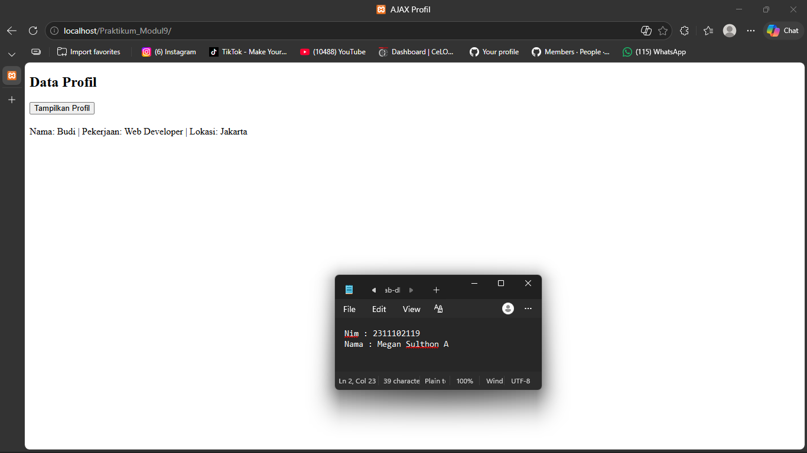

<div align="center">
  <br />
  <h1>LAPORAN PRAKTIKUM <br> APLIKASI BERBASIS PLATFORM </h1>
  <br />
  <h3>MODUL 10 <br> AJAX </h3>
  <br />
  
  <br />
  <br />
  <br />
  <h3>Disusun Oleh :</h3>
  <p>
    <strong>Megan Sulthon Aryomukti</strong>
    <br>
    <strong>2311102119</strong>
    <br>
    <strong>S1 IF-11-REG05</strong>
  </p>
  <br />
  <h3>Dosen Pengampu :</h3>
  <p>
    <strong>Dedi Agung Prabowo, S.Kom., M.Kom</strong>
  </p>
  <br />
  <br />
  <h4>Asisten Praktikum :</h4>
  <strong>Apri Pandu Wicaksono</strong>
  <br>
  <strong>Hamka Zaenul Ardi</strong>
  <br />
  <h3>LABORATORIUM HIGH PERFORMANCE <br>FAKULTAS INFORMATIKA <br>UNIVERSITAS TELKOM PURWOKERTO <br>2026 </h3>
</div>

<hr>

# Dasar Teori

## 1. Pengertian AJAX

AJAX (*Asynchronous JavaScript and XML*) merupakan teknik dalam pengembangan web yang memungkinkan pengambilan data dari server tanpa harus melakukan reload seluruh halaman. Dengan metode ini, halaman web menjadi lebih interaktif dan responsif karena hanya bagian tertentu saja yang diperbarui. Saat ini, JSON lebih sering digunakan dibandingkan XML karena lebih ringan dan mudah diproses.

---

## 2. Cara Kerja AJAX

AJAX bekerja dengan menghubungkan client dan server secara asynchronous. Proses dimulai dari aksi pengguna, lalu JavaScript mengirim request ke server. Server akan memproses dan mengembalikan data dalam bentuk JSON, kemudian ditampilkan ke halaman menggunakan DOM.

### Alur singkat:
1. User menekan tombol
2. JavaScript mengirim request
3. Server mengirim response (JSON)
4. Data ditampilkan di halaman

#### Contoh:
```html
fetch("data.php")
  .then(response => response.json())
  .then(data => {
    document.getElementById("hasil-profil").innerHTML =
      `Nama: ${data.nama} | Pekerjaan: ${data.pekerjaan} | Lokasi: ${data.lokasi}`;
  });

```
## 3. Output

  