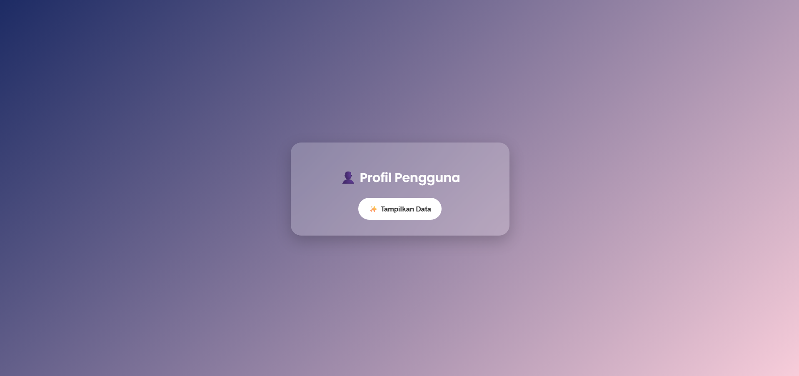
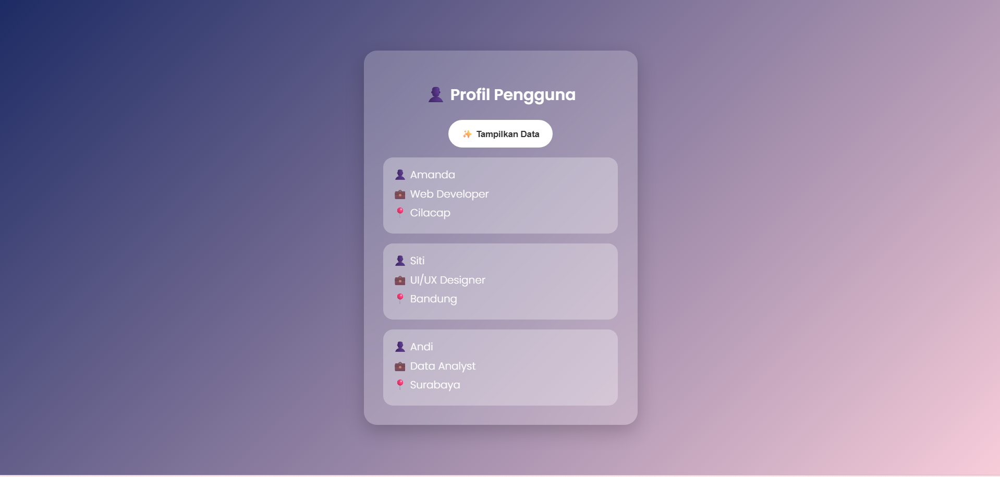

<div align="center">
  <br />
  <h1>LAPORAN PRAKTIKUM <br> APLIKASI BERBASIS PLATFORM </h1>
  <br />
  <h3>MODUL 10 <br> AJAX </h3>
  <br />
  
  <br />
  <br />
  <br />
  <h3>Disusun Oleh :</h3>
  <p>
    <strong>Amanda Windhu Gustyas</strong>
    <br>
    <strong>2311102121</strong>
    <br>
    <strong>S1 IF-11-REG05</strong>
  </p>
  <br />
  <h3>Dosen Pengampu :</h3>
  <p>
    <strong>Dedi Agung Prabowo, S.Kom., M.Kom</strong>
  </p>
  <br />
  <br />
  <h4>Asisten Praktikum :</h4>
  <strong>Apri Pandu Wicaksono </strong>
  <br>
  <strong>Hamka Zaenul Ardi</strong>
  <br />
  <h3>LABORATORIUM HIGH PERFORMANCE <br>FAKULTAS INFORMATIKA <br>UNIVERSITAS TELKOM PURWOKERTO <br>2026 </h3>
</div>

<hr>

# Dasar Teori

AJAX merupakan singkatan dari Asynchronous JavaScript and XML, yaitu teknik dalam pengembangan web yang digunakan untuk melakukan pertukaran data antara client (browser) dan server secara asynchronous tanpa harus melakukan reload halaman secara keseluruhan. Dengan AJAX, aplikasi web dapat menjadi lebih interaktif, cepat, dan responsif karena hanya bagian tertentu dari halaman yang diperbarui.

Konsep utama dari AJAX adalah penggunaan JavaScript untuk mengirim dan menerima data dari server di belakang layar (background), sehingga pengguna tidak merasakan adanya proses pemuatan ulang (reload). Hal ini berbeda dengan metode tradisional di mana setiap interaksi yang membutuhkan data dari server akan memuat ulang seluruh halaman web.

Dalam implementasinya, AJAX tidak hanya menggunakan XML seperti namanya, tetapi juga dapat menggunakan format data lain yang lebih populer seperti JSON (JavaScript Object Notation). JSON lebih banyak digunakan karena lebih ringan dan mudah diproses oleh JavaScript.
Secara umum, AJAX bekerja melalui beberapa komponen utama, yaitu:
1. HTML dan CSS digunakan untuk menampilkan struktur dan tampilan halaman web.
2. JavaScript digunakan untuk mengatur logika dan komunikasi dengan server.
3. XMLHttpRequest atau Fetch API digunakan untuk mengirim request ke server dan menerima response.
4. Server-side (misalnya PHP) digunakan untuk memproses data dan mengirimkan response kembali ke client dalam format tertentu.

Alur kerja AJAX dimulai ketika pengguna melakukan suatu aksi, seperti menekan tombol. JavaScript kemudian mengirimkan request ke server tanpa menghentikan aktivitas halaman. Server memproses permintaan tersebut dan mengirimkan response kembali, yang kemudian diproses oleh JavaScript untuk memperbarui bagian tertentu dari halaman web.

Seiring perkembangan teknologi, penggunaan AJAX kini lebih banyak menggunakan Fetch API dibandingkan XMLHttpRequest karena sintaksnya lebih sederhana dan mudah dipahami. Fetch API memungkinkan pengambilan data secara asynchronous dengan menggunakan konsep Promise, sehingga kode menjadi lebih ringkas dan terstruktur.

# Tugas 10
## Kode 1
```php
//2311102121
//Amanda Windhu Gustyas

<?php
header('Content-Type: application/json');

// Data sederhana (database tiruan)
$data = [
    [
        'nama' => 'Amanda',
        'pekerjaan' => 'Web Developer',
        'lokasi' => 'Cilacap'
    ],
    [
        'nama' => 'Siti',
        'pekerjaan' => 'UI/UX Designer',
        'lokasi' => 'Bandung'
    ],
    [
        'nama' => 'Andi',
        'pekerjaan' => 'Data Analyst',
        'lokasi' => 'Surabaya'
    ]
];

// Ubah ke JSON
echo json_encode($data);
?>
```

## Kode 2
```html
<!DOCTYPE html>
<html lang="id">
<head>
<meta charset="UTF-8">
<title>Profil Pengguna</title>

<link href="https://fonts.googleapis.com/css2?family=Poppins:wght@300;600&display=swap" rel="stylesheet">

<style>
body {
    margin: 0;
    height: 100vh;
    display: flex;
    justify-content: center;
    align-items: center;
    font-family: 'Poppins', sans-serif;

    /* beda warna total */
    background: linear-gradient(135deg, #1d2b64, #f8cdda);
}

.container {
    backdrop-filter: blur(15px);
    background: rgba(255,255,255,0.2);
    border-radius: 20px;
    padding: 30px;
    width: 360px;
    text-align: center;
    box-shadow: 0 10px 30px rgba(0,0,0,0.2);
    color: white;
}

h2 {
    margin-bottom: 20px;
}

button {
    background: white;
    color: #333;
    border: none;
    padding: 12px 20px;
    border-radius: 25px;
    cursor: pointer;
    font-weight: bold;
    transition: 0.3s;
}

button:hover {
    background: #eee;
    transform: scale(1.05);
}

.card {
    background: rgba(255,255,255,0.3);
    margin-top: 15px;
    padding: 15px;
    border-radius: 15px;
    text-align: left;
    animation: fadeUp 0.5s ease;
}

.card span {
    display: block;
    margin-bottom: 5px;
}

@keyframes fadeUp {
    from {opacity:0; transform:translateY(20px);}
    to {opacity:1; transform:translateY(0);}
}
</style>
</head>

<body>

<div class="container">
    <h2>👤 Profil Pengguna</h2>
    <button onclick="ambilData()">✨ Tampilkan Data</button>

    <div id="hasil"></div>
</div>

<script>
function ambilData() {
    fetch('data.php')
    .then(res => res.json())
    .then(data => {
        let output = '';

        data.forEach(item => {
            output += `
                <div class="card">
                    <span>👤 ${item.nama}</span>
                    <span>💼 ${item.pekerjaan}</span>
                    <span>📍 ${item.lokasi}</span>
                </div>
            `;
        });

        document.getElementById('hasil').innerHTML = output;
    });
}
</script>

</body>
</html>
```

Output:
 


# Penjelasan
Kode AJAX pada program ini menggunakan fungsi ambilData() yang dijalankan saat tombol diklik. Fungsi tersebut memanfaatkan Fetch API untuk mengambil data dari data.php secara asynchronous tanpa melakukan reload halaman. Data yang diterima kemudian diubah ke format JSON dan diproses menggunakan perulangan untuk menampilkan setiap informasi profil seperti nama, pekerjaan, dan lokasi ke dalam elemen HTML secara dinamis. Hasilnya ditampilkan pada halaman menggunakan innerHTML.

Di sisi server, file data.php menyediakan data dalam bentuk array yang kemudian diubah menjadi JSON menggunakan json_encode() dan dikirim ke client. Dengan demikian, program ini menerapkan konsep AJAX yang memungkinkan pertukaran data antara client dan server secara efisien tanpa memuat ulang halaman, sehingga meningkatkan interaktivitas aplikasi web.