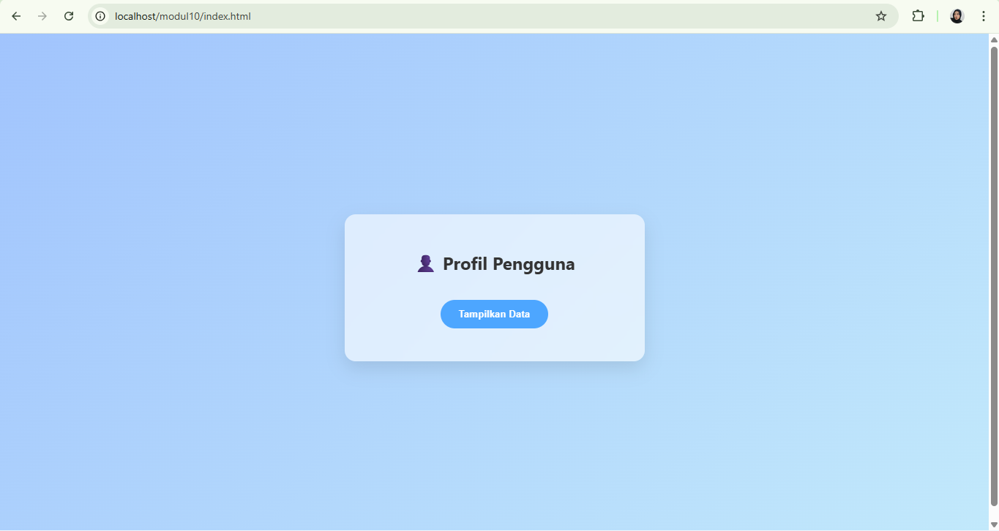
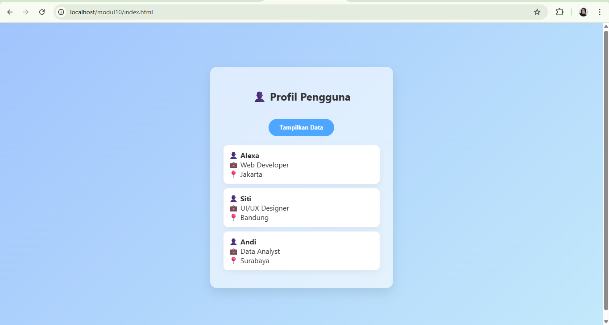

<div align="center">
  <br />
  <h1>LAPORAN PRAKTIKUM <br> APLIKASI BERBASIS PLATFORM </h1>
  <br />
  <h3>MODUL 9 <br> AJAX </h3>
  <br />
  
  <br />
  <br />
  <br />
  <h3>Disusun Oleh :</h3>
  <p>
    <strong>Naya Putwi Setiasih</strong>
    <br>
    <strong>2311102155</strong>
    <br>
    <strong>S1 IF-11-REG05</strong>
  </p>
  <br />
  <h3>Dosen Pengampu :</h3>
  <p>
    <strong>Dedi Agung Prabowo, S.Kom., M.Kom</strong>
  </p>
  <br />
  <br />
  <h4>Asisten Praktikum :</h4>
  <strong>Apri Pandu Wicaksono </strong>
  <br>
  <strong>Hamka Zaenul Ardi</strong>
  <br />
  <h3>LABORATORIUM HIGH PERFORMANCE <br>FAKULTAS INFORMATIKA <br>UNIVERSITAS TELKOM PURWOKERTO <br>2026 </h3>
</div>

<hr>

# Dasar Teori

AJAX (Asynchronous JavaScript and XML) adalah teknik dalam pengembangan web yang memungkinkan aplikasi berkomunikasi dengan server secara asynchronous tanpa harus memuat ulang (reload) seluruh halaman. Dengan memanfaatkan JavaScript, AJAX menggunakan objek seperti <code>XMLHttpRequest</code> atau teknologi modern seperti <code>fetch API</code> untuk mengirim dan menerima data di latar belakang. Data yang dipertukarkan tidak terbatas pada XML saja, tetapi juga dapat berupa JSON, teks, atau HTML.

Penggunaan AJAX memungkinkan bagian tertentu dari halaman web diperbarui secara dinamis sesuai kebutuhan tanpa mengganggu keseluruhan tampilan. Teknologi ini banyak digunakan dalam aplikasi web modern, seperti fitur pencarian otomatis, validasi form secara real-time, serta pengambilan data secara cepat. Dengan demikian, AJAX membantu meningkatkan efisiensi, kecepatan, dan interaktivitas dalam pengalaman pengguna.


## Tugas Modul 9 - AJAX
### Souce code - data.php
```php
<?php
header('Content-Type: application/json');

$data = [
    ['nama' => 'Alexa', 'pekerjaan' => 'Web Developer', 'lokasi' => 'Jakarta'],
    ['nama' => 'Siti', 'pekerjaan' => 'UI/UX Designer', 'lokasi' => 'Bandung'],
    ['nama' => 'Andi', 'pekerjaan' => 'Data Analyst', 'lokasi' => 'Surabaya']
];

echo json_encode($data);
```

### Source code - index.html
```html
<!DOCTYPE html>
<html lang="id">
<head>
<meta charset="UTF-8">
<title>Profil Pengguna</title>

<style>
body {
    font-family: 'Segoe UI', sans-serif;
    background: linear-gradient(135deg, #a1c4fd, #c2e9fb);
    height: 100vh;
    display: flex;
    justify-content: center;
    align-items: center;
}

/* CARD */
.card {
    background: rgba(255,255,255,0.6);
    backdrop-filter: blur(10px);
    padding: 30px;
    border-radius: 15px;
    width: 350px;
    text-align: center;
    color: #333;
    box-shadow: 0 10px 25px rgba(0,0,0,0.1);
}

/* BUTTON */
button {
    margin-top: 15px;
    padding: 12px 25px;
    border: none;
    border-radius: 25px;
    background: #4da6ff;
    color: white;
    font-weight: bold;
    cursor: pointer;
    transition: 0.3s;
}

button:hover {
    background: #3399ff;
    transform: scale(1.05);
}

/* LOADING */
.loading {
    margin-top: 15px;
    font-size: 14px;
    color: #555;
}

/* HASIL */
#hasil-profil {
    margin-top: 20px;
    display: none;
}

/* ITEM */
.profil-item {
    background: white;
    padding: 12px;
    border-radius: 10px;
    margin-bottom: 10px;
    text-align: left;
    box-shadow: 0 5px 15px rgba(0,0,0,0.05);
    animation: fadeIn 0.4s ease forwards;
    transform: translateY(10px);
    opacity: 0;
}

/* ANIMASI */
@keyframes fadeIn {
    to {
        transform: translateY(0);
        opacity: 1;
    }
}
</style>
</head>

<body>

<div class="card">
    <h2>👤 Profil Pengguna</h2>

    <button id="btn">Tampilkan Data</button>

    <div class="loading" id="loading"></div>

    <div id="hasil-profil"></div>
</div>

<script>
const btn = document.getElementById('btn');
const hasil = document.getElementById('hasil-profil');
const loading = document.getElementById('loading');

btn.addEventListener('click', () => {
    btn.disabled = true;

    loading.innerText = "⏳ Mengambil data...";
    hasil.style.display = "none";

    fetch('data.php')
        .then(res => res.json())
        .then(data => {
            loading.innerText = "";
            hasil.innerHTML = "";
            hasil.style.display = "block";

            data.forEach((item, index) => {
                const div = document.createElement('div');
                div.classList.add('profil-item');
                div.style.animationDelay = `${index * 0.2}s`;

                div.innerHTML = `
                    👤 <b>${item.nama}</b><br>
                    💼 ${item.pekerjaan}<br>
                    📍 ${item.lokasi}
                `;

                hasil.appendChild(div);
            });

            btn.disabled = false;
        })
        .catch(() => {
            loading.innerText = "❌ Gagal mengambil data";
            btn.disabled = false;
        });
});
</script>

</body>
</html>
```

### Screenshots Output

<br>


# Penjelasan
Kode ini digunakan untuk mengambil data dari server menggunakan AJAX (fetch()) tanpa reload halaman. Saat tombol diklik, JavaScript mengirim request ke data.php, lalu data yang diterima dalam format JSON diubah menjadi objek dan ditampilkan ke dalam <div id="hasil-profil">. Sebelum data muncul, ditampilkan pesan loading sebagai indikator proses agar pengguna tahu sistem sedang bekerja.

Data ditampilkan satu per satu menggunakan perulangan forEach dan dimasukkan ke dalam elemen HTML secara dinamis. Tampilan dibuat lebih menarik dengan CSS seperti background biru gradasi, card transparan, serta animasi agar data muncul secara halus. Selain itu, terdapat penanganan error sederhana untuk menampilkan pesan jika terjadi kegagalan saat mengambil data.