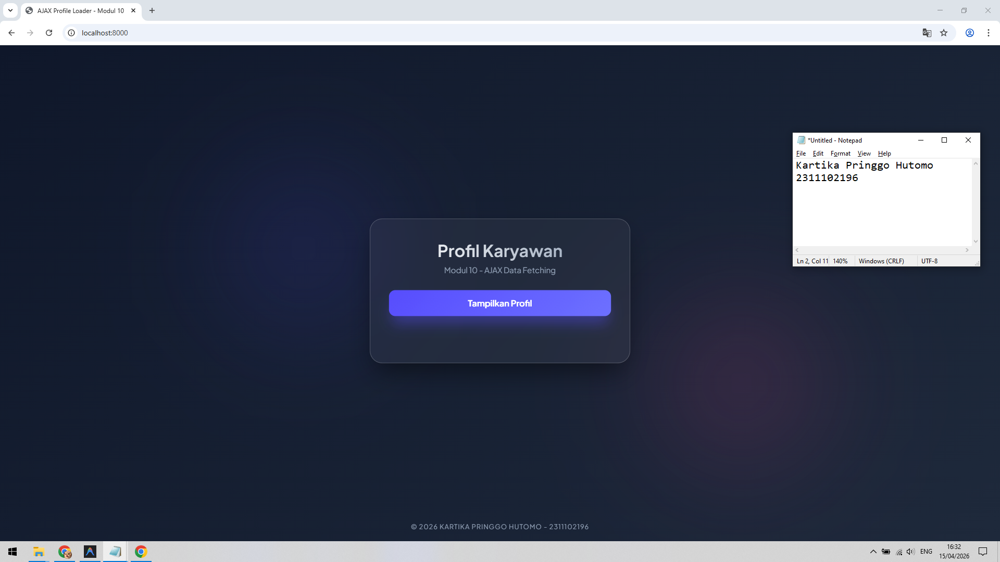
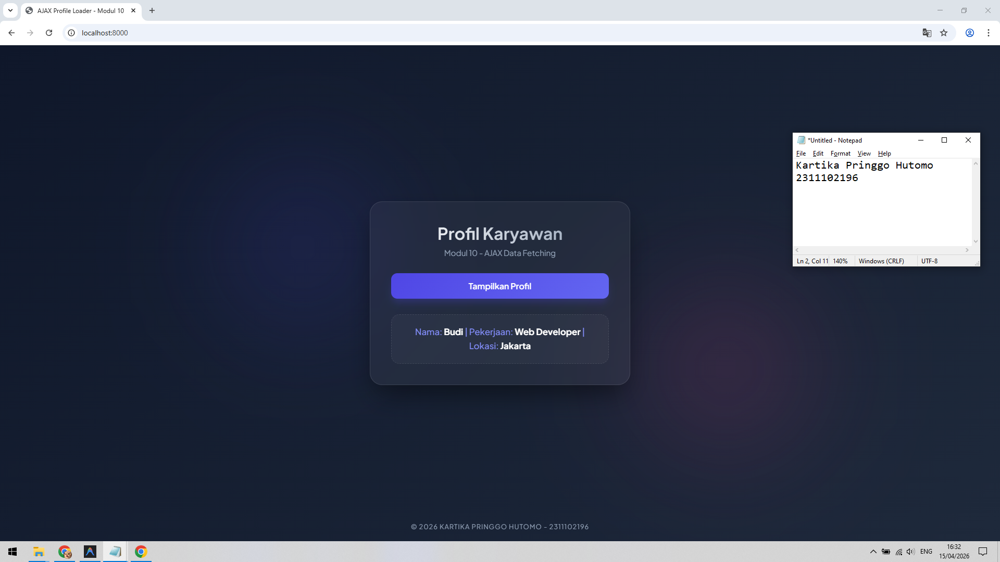

<div align="center">
    <br />
    <h1>LAPORAN PRAKTIKUM <br> APLIKASI BERBASIS PLATFORM </h1>
    <br />
    <h3>MODUL 10 <br> AJAX </h3>
    <br />
    
    <br />
    <br />
    <br />
    <h3>Disusun Oleh :</h3>
    <p>
        <strong>Kartika Pringgo Hutomo</strong>
        <br>
        <strong>2311102196</strong>
        <br>
        <strong>S1 IF-11-REG05</strong>
    </p>
    <br />
    <h3>Dosen Pengampu :</h3>
    <p>
        <strong>Dedi Agung Prabowo, S.Kom., M.Kom</strong>
    </p>
    <br />
    <br />
    <h4>Asisten Praktikum :</h4>
    <strong>Apri Pandu Wicaksono </strong>
    <br>
    <strong>Hamka Zaenul Ardi</strong>
    <br />
    <h3>LABORATORIUM HIGH PERFORMANCE <br>FAKULTAS INFORMATIKA <br>UNIVERSITAS TELKOM PURWOKERTO <br>2026 </h3>
</div>
<hr>

## Dasar Teori

1. Pengertian AJAX AJAX (Asynchronous JavaScript and XML) adalah sebuah teknik pengembangan web yang memungkinkan halaman web untuk berkomunikasi dengan server secara asynchronous (tidak sinkron). Artinya, browser dapat mengirim dan menerima data dari server di latar belakang tanpa harus menyegarkan (reload) seluruh halaman.

2. Cara Kerja AJAX Secara tradisional, setiap interaksi pengguna dengan server mengharuskan browser memuat ulang seluruh halaman. Dengan AJAX, proses tersebut disederhanakan sebagai berikut:

Event terjadi: Pengguna melakukan aksi (misalnya klik tombol).
Permintaan (Request): JavaScript membuat objek (seperti XMLHttpRequest atau menggunakan fetch()) untuk mengirim permintaan data ke server.
Pemrosesan Server: Server (misal PHP) menerima permintaan, mengolah data, dan mengirimkan respon kembali.
Respon Terkirim: Browser menerima data respon (biasanya dalam format JSON atau XML).
Update DOM: JavaScript memperbarui hanya bagian tertentu dari halaman HTML berdasarkan data yang diterima.
3. Teknologi Utama dalam AJAX

JavaScript: Bahasa pemrograman utama yang mengelola logika pengiriman dan penerimaan data.
DOM (Document Object Model): Digunakan untuk memanipulasi struktur halaman agar tampilan berubah secara dinamis.
Fetch API / XMLHttpRequest: Antarmuka yang menyediakan cara untuk mengambil sumber daya (data) dari server.
JSON (JavaScript Object Notation): Format pertukaran data yang paling populer saat ini karena ringan dan mudah dibaca oleh JavaScript.
4. Keuntungan Menggunakan AJAX

User Experience (UX) yang Lebih Baik: Interaksi terasa lebih cepat dan responsif layaknya aplikasi desktop.
Efisiensi Bandwidth: Hanya data yang diperlukan saja yang dikirimkan, bukan seluruh struktur HTML halaman.
Beban Server Berkurang: Server tidak perlu merender ulang seluruh komponen halaman untuk setiap permintaan kecil.


## Tugas Modul 9 - PHP: Sistem Penilaian Mahasiswa

### Source Code

```php
<?php
/**
 * Tugas Modul 10 - AJAX (Server Side)
 * Nama: Kartika Pringgo Hutomo
 * NIM: 2311102196
 */

// Header agar browser mengenali response sebagai JSON
header('Content-Type: application/json');

// Data array sederhana sesuai instruksi
$data = [
    'nama' => 'Budi',
    'pekerjaan' => 'Web Developer',
    'lokasi' => 'Jakarta'
];

// Mengubah array menjadi format JSON dan menampilkannya
echo json_encode($data);
?>

```

**Kode Lengkap:** [data.php](data.php)


```html
<!DOCTYPE html>
<html lang="id">
<head>
    <meta charset="UTF-8">
    <meta name="viewport" content="width=device-width, initial-scale=1.0">
    <title>AJAX Profile Loader - Modul 10</title>
    <meta name="description" content="Tugas Modul 10 - Implementasi AJAX menggunakan Fetch API untuk mengambil data profil tanpa reload.">
    <!-- Google Fonts -->
    <link rel="preconnect" href="https://fonts.googleapis.com">
    <link rel="preconnect" href="https://fonts.gstatic.com" crossorigin>
    <link href="https://fonts.googleapis.com/css2?family=Plus+Jakarta+Sans:wght@400;500;600;700&display=swap" rel="stylesheet">
    <style>
        :root {
            --primary: #4f46e5;
            --primary-light: #818cf8;
            --secondary: #ec4899;
            --bg-gradient: linear-gradient(135deg, #0f172a 0%, #1e293b 100%);
            --card-gray: rgba(30, 41, 59, 0.7);
            --text-main: #f8fafc;
            --text-muted: #94a3b8;
            --glass-bg: rgba(255, 255, 255, 0.05);
            --glass-border: rgba(255, 255, 255, 0.1);
        }

        * {

```

**Kode Lengkap:** [index.html](index.html)

Output:



### Penjelasan

Website ini adalah aplikasi profil dinamis yang menggunakan teknologi AJAX untuk mengambil data dari server PHP dan menampilkannya secara instan tanpa perlu memuat ulang halaman. Hal ini memungkinkan pengalaman pengguna yang lebih cepat dan interaktif melalui komunikasi data di latar belakang menggunakan Fetch API.