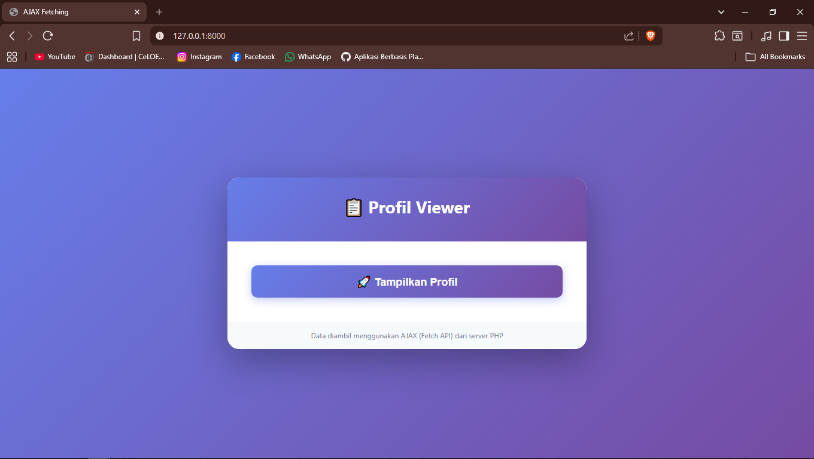
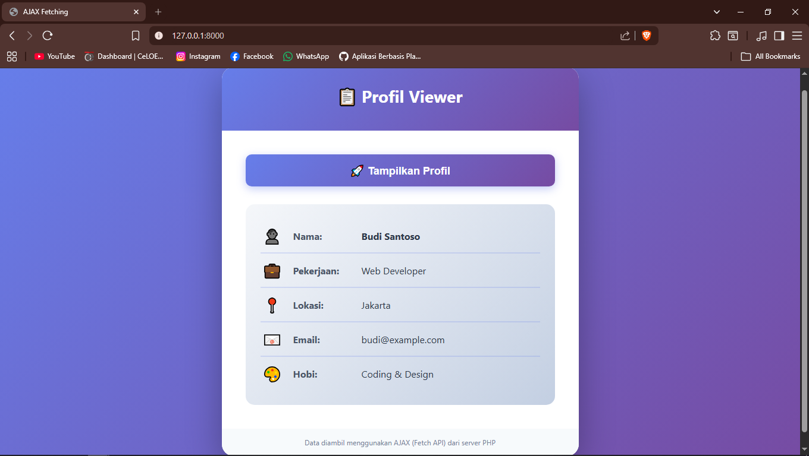

<div align="center">
  <br />
  <h1>LAPORAN PRAKTIKUM <br> APLIKASI BERBASIS PLATFORM </h1>
  <br />
  <h3>MODUL 10 <br> AJAX </h3>
  <br />
  
  <br />
  <br />
  <br />
  <h3>Disusun Oleh :</h3>
  <p>
    <strong>Arya Bima</strong>
    <br>
    <strong>2311102257</strong>
    <br>
    <strong>S1 IF-11-REG05</strong>
  </p>
  <br />
  <h3>Dosen Pengampu :</h3>
  <p>
    <strong>Dedi Agung Prabowo, S.Kom., M.Kom</strong>
  </p>
  <br />
  <br />
  <h4>Asisten Praktikum :</h4>
  <strong>Apri Pandu Wicaksono </strong>
  <br>
  <strong>Hamka Zaenul Ardi</strong>
  <br />
  <h3>LABORATORIUM HIGH PERFORMANCE <br>FAKULTAS INFORMATIKA <br>UNIVERSITAS TELKOM PURWOKERTO <br>2026 </h3>
</div>

<hr>

# Dasar Teori

### Pengertian AJAX

AJAX merupakan singkatan dari **Asynchronous JavaScript and XML**. AJAX bukanlah sebuah bahasa pemrograman, melainkan sebuah teknik pengembangan web yang memungkinkan halaman web untuk berkomunikasi dengan server secara asinkron di belakang layar. Artinya, halaman web dapat mengirim dan menerima data dari server tanpa harus melakukan reload atau refresh seluruh halaman. Teknik ini pertama kali diperkenalkan oleh Jesse James Garrett pada tahun 2005 dan sejak saat itu menjadi fondasi utama dalam pengembangan aplikasi web modern.

### Komponen Utama AJAX

AJAX menggabungkan beberapa teknologi yang sudah ada sebelumnya:

1. **HTML/CSS** - Untuk membangun antarmuka pengguna dan styling
2. **DOM (Document Object Model)** - Untuk memanipulasi struktur halaman secara dinamis
3. **JavaScript** - Sebagai logika utama untuk mengontrol komunikasi asinkron
4. **XMLHttpRequest Object** - Objek inti yang digunakan untuk berkomunikasi dengan server
5. **JSON/XML** - Format data yang dikirimkan antara client dan server (JSON lebih umum digunakan saat ini)

### Prinsip Kerja AJAX

Mekanisme kerja AJAX berbeda secara fundamental dengan model request-response tradisional:

**Model Tradisional (Sinkron):**
- User melakukan aksi (klik link/submit form)
- Browser mengirim request ke server
- Server memproses dan mengirim response
- Browser me-reload seluruh halaman
- User menunggu hingga halaman selesai dimuat ulang

**Model AJAX (Asinkron):**
- User melakukan aksi (klik tombol)
- JavaScript membuat objek XMLHttpRequest
- Request dikirim ke server di background
- Server memproses dan mengirim response (biasanya JSON)
- JavaScript menerima data dan memanipulasi DOM
- Halaman tidak reload, hanya bagian tertentu yang berubah

### Keunggulan AJAX

Penerapan AJAX dalam pengembangan web memberikan berbagai keuntungan signifikan:

1. **User Experience Lebih Baik** - Halaman tidak berkedip atau reload, interaksi terasa lebih mulus seperti aplikasi desktop
2. **Efisiensi Bandwidth** - Hanya data yang diperlukan yang ditransfer, bukan seluruh halaman HTML
2. **Responsivitas Tinggi** - Pengguna tetap dapat berinteraksi dengan halaman saat proses pengambilan data berlangsung
3. **Mengurangi Beban Server** - Server hanya memproses data spesifik tanpa harus merender ulang halaman lengkap
4. **Pengembangan SPA (Single Page Application)** - Memungkinkan pembuatan aplikasi web dengan satu halaman yang dinamis

---

# Tugas 10: AJAX Fetching
#### data.php:
```php
<?php
header('Content-Type: application/json');

// Data contoh
$data = [
    'nama' => 'Budi Santoso',
    'pekerjaan' => 'Web Developer',
    'lokasi' => 'Jakarta',
    'email' => 'budi@example.com',
    'hobi' => 'Coding & Design'
];

// Mengubah array menjadi format JSON
echo json_encode($data);
?>
```

#### index.html:
```html
<!DOCTYPE html>
<html lang="id">
<head>
    <meta charset="UTF-8">
    <meta name="viewport" content="width=device-width, initial-scale=1.0">
    <title>AJAX Fetching</title>
    <link rel="stylesheet" href="style.css">
</head>
<body>
    <div class="container">
        <div class="header">
            <h1>📋 Profil Viewer</h1>
        </div>

        <div class="content">
            <button class="btn-load" id="loadProfileBtn">
                🚀 Tampilkan Profil
            </button>

            <div class="loading" id="loadingIndicator">
                <div class="spinner"></div>
                <p>Mengambil data dari server...</p>
            </div>

            <div id="hasil-profil" class="profile-card"></div>

            <div class="error-message" id="errorMessage">
                ⚠️ Gagal mengambil data. Silakan coba lagi.
            </div>
        </div>

        <div class="footer">
            <p>Data diambil menggunakan AJAX (Fetch API) dari server PHP</p>
        </div>
    </div>

    <script>
        // Mengambil elemen DOM
        const loadButton = document.getElementById('loadProfileBtn');
        const hasilProfilDiv = document.getElementById('hasil-profil');
        const loadingIndicator = document.getElementById('loadingIndicator');
        const errorMessage = document.getElementById('errorMessage');

        // Fungsi untuk menampilkan data profil
        function displayProfile(data) {
            hasilProfilDiv.innerHTML = `
                <div class="profile-item">
                    <div class="profile-icon">👤</div>
                    <div class="profile-label">Nama:</div>
                    <div class="profile-value"><strong>${escapeHtml(data.nama)}</strong></div>
                </div>
                <div class="profile-item">
                    <div class="profile-icon">💼</div>
                    <div class="profile-label">Pekerjaan:</div>
                    <div class="profile-value">${escapeHtml(data.pekerjaan)}</div>
                </div>
                <div class="profile-item">
                    <div class="profile-icon">📍</div>
                    <div class="profile-label">Lokasi:</div>
                    <div class="profile-value">${escapeHtml(data.lokasi)}</div>
                </div>
                <div class="profile-item">
                    <div class="profile-icon">📧</div>
                    <div class="profile-label">Email:</div>
                    <div class="profile-value">${escapeHtml(data.email)}</div>
                </div>
                <div class="profile-item">
                    <div class="profile-icon">🎨</div>
                    <div class="profile-label">Hobi:</div>
                    <div class="profile-value">${escapeHtml(data.hobi)}</div>
                </div>
            `;
            hasilProfilDiv.classList.add('show');
        }

        // Fungsi untuk membersihkan HTML (security)
        function escapeHtml(text) {
            const div = document.createElement('div');
            div.textContent = text;
            return div.innerHTML;
        }

        // Fungsi untuk mengambil data dari server menggunakan Fetch API
        async function fetchProfile() {
            // Reset tampilan
            hasilProfilDiv.classList.remove('show');
            errorMessage.classList.remove('show');
            
            // Tampilkan loading
            loadingIndicator.classList.add('show');
            loadButton.disabled = true;
            loadButton.textContent = '⏳ Mengambil Data...';

            try {
                // Mengambil data dari server
                const response = await fetch('data.php', {
                    method: 'GET',
                    headers: {
                        'Accept': 'application/json'
                    }
                });

                // Cek apakah response OK
                if (!response.ok) {
                    throw new Error(`HTTP error! status: ${response.status}`);
                }

                // Parse JSON response
                const data = await response.json();

                // Cek apakah data valid
                if (data && data.nama) {
                    // Tampilkan data
                    displayProfile(data);
                } else {
                    throw new Error('Data tidak lengkap');
                }

            } catch (error) {
                console.error('Error:', error);
                // Tampilkan pesan error
                errorMessage.classList.add('show');
                setTimeout(() => {
                    errorMessage.classList.remove('show');
                }, 3000);
            } finally {
                // Sembunyikan loading
                loadingIndicator.classList.remove('show');
                loadButton.disabled = false;
                loadButton.textContent = '🚀 Tampilkan Profil';
            }
        }

        // Event listener untuk tombol
        loadButton.addEventListener('click', fetchProfile);

    </script>
</body>
</html>
```
#### style.css:
<a href="./style.css">LINK CSS</a>

### output:



**Penjelasan:**
Web berbasis AJAX yang menampilkan data profil dari server tanpa reload halaman. Aplikasi ini terdiri dari file data.php (server penyedia data JSON) dan index.html (antarmuka pengguna).

Alur kerjanya: Saat pengguna mengklik tombol "Tampilkan Profil", JavaScript mengirim request ke data.php menggunakan Fetch API. Server merespon dengan mengirimkan data profil (nama, pekerjaan, lokasi, dll) dalam format JSON. Selama proses berlangsung, muncul animasi loading. Setelah data diterima, JavaScript langsung menampilkannya ke dalam card profil di halaman yang sama. Jika terjadi error, aplikasi akan menampilkan pesan kegagalan. Seluruh proses berjalan asinkron sehingga halaman tidak pernah reload/berkedip, memberikan pengalaman pengguna yang mulus dan responsif.