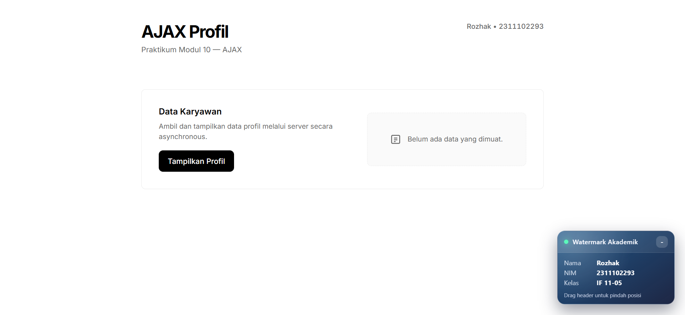
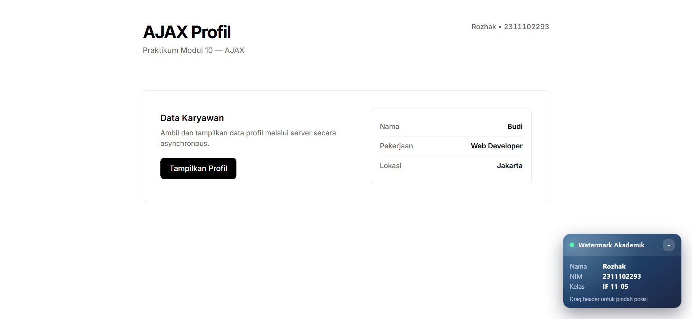

<div align="center">
    <br />
    <h1>LAPORAN PRAKTIKUM <br> APLIKASI BERBASIS PLATFORM </h1>
    <br />
    <h3>MODUL 10 <br> AJAX </h3>
    <br />
    
    <br />
    <br />
    <br />
    <h3>Disusun Oleh :</h3>
    <p>
        <strong>Rozhak</strong>
        <br>
        <strong>2311102293</strong>
        <br>
        <strong>S1 IF-11-REG05</strong>
    </p>
    <br />
    <h3>Dosen Pengampu :</h3>
    <p>
        <strong>Dedi Agung Prabowo, S.Kom., M.Kom</strong>
    </p>
    <br />
    <br />
    <h4>Asisten Praktikum :</h4>
    <strong>Apri Pandu Wicaksono </strong>
    <br>
    <strong>Hamka Zaenul Ardi</strong>
    <br />
    <h3>LABORATORIUM HIGH PERFORMANCE <br>FAKULTAS INFORMATIKA <br>UNIVERSITAS TELKOM PURWOKERTO <br>2026 </h3>
</div>
<hr>

## Dasar Teori

AJAX (_Asynchronous JavaScript and XML_) merupakan sebuah pendekatan dan teknik pemrograman berbasis web yang dirancang untuk menciptakan aplikasi web interaktif. Berbeda dengan siklus sinkron konvensional yang mengharuskan perambanan untuk memuat ulang keseluruhan halaman setiap kali terdapat prmrosesan data, AJAX memungkinkan sebagian besar interaksi dieksekusi di sisi klien secara asinkron. Teknik ini melakukan proses pertukaran paket data dengan peladen (_server_) secara diam-diam di belakang layar (_background_). Pendekatan ini secara signifikan mampu meningkatkan interaktivitas, kecepatan pemuatan, serta _usability_ dari sebuah sistem web.

Secara fundamental, mekanisme kerja AJAX berpusat pada dua komponen utama: objek pemroses _request_ (seperti `XMLHttpRequest` atau antarmuka modern `Fetch API`) yang bertugas membuka koneksi dan meminta data dari peladen, serta penggunaan JavaScript yang dokombinasikan dengan manipulasi _Document Object Model (DOM)_ untuk merender respons balikan ke layar peramban. Meskipun memiliki singkatan XML, implementasi AJAX modern saat ini jauh lebih masih menggunakan format JSON (_JavaScript Object Notation_) sebagai standar pertukaran data antar _client_ dan _server_ karena ukurannya yang lebih ringan dan mudah diurai secara langsung oleh JavaScript.

## Tugas Modul 10 - Ajax

### 1. Source Code

```php
<?php
header('Content-Type: application/json');
header('Access-Control-Allow-Origin: *');

$data = [
    ...
];

echo json_encode($data);
```

**Kode Lengkap:** [api/data.php](api/data.php)

```js
document.addEventListener('DOMContentLoaded', () => {
    const btnTampil = document.getElementById('btn-tampil');
    const hasilProfil = document.getElementById('hasil-profil');
    
    if (!btnTampil || !hasilProfil) return;

    btnTampil.addEventListener('click', async () => {
        const originalText = btnTampil.innerText;
        
        btnTampil.innerHTML = `
            ...
        `;
        btnTampil.disabled = true;
        btnTampil.setAttribute('aria-expanded', 'true');

        try {
            const response = await fetch('../api/data.php');

            if (!response.ok) {
                throw new Error(`HTTP Error! Status: ${response.status}`);
            }
            
            const data = await response.json();

            hasilProfil.innerHTML = `
                ...
            `;
            
            hasilProfil.style.borderStyle = 'solid';
            hasilProfil.style.background = 'transparent';

        } catch (error) {
            hasilProfil.innerHTML = `
                ...
            `;
            hasilProfil.style.borderStyle = 'solid';
        } finally {
            btnTampil.innerHTML = `<span>${originalText}</span>`;
            btnTampil.disabled = false;
            btnTampil.setAttribute('aria-expanded', 'false');
        }
    });
});
```

**Kode Lengkap:** [public/assets/js/ajax.js](public/assets/js/ajax.js)

### 2. Penjelasan

Aplikasi web ini mengimplementasikan konsep komunikasi _Client-Server_ asinkron menggunakan pendekatan modular. Pada sisi _backend_, file PHP (`data.php`) difungsikan sebagai _endpoint_ REST API sederhaan yang mengubah struktur _Array_ Asosiatif berisi data profil menjadi string JSON melalui fungsi `json_encode()`, lengkap dengan penyertaan penanda _header_ `application/json` agar peramban meresponsnya sebagai entitas data.

Pada sisi antarmuka (_frontend_), menyiapkan elemen tombol pemicu dan sebuah _container_ (wadah) ber-ID khusus untuk menampung data luaran. Seluruh logika AJAX dipisahkan secara rapi ke dalam berkas JavaScript (`ajax.js`). ketika pengguna menekan tombol, sistem akan mencegat aksi tersebut dan menjalankan metode modern `Fetch API` berkonsep _async/await_ untuk meminta data JSON ke peladen. Saat proses berlangsung, antarmuka akan memberikan respon visual berupa indikator pemuatan (_loading spinner_). Setelah peladen berhasil mengembalikan respons dengan status HTTP status (200 OK), JavaScript akan mengekstrak JSON tersebut dan memanipulasi _Document Object Model_ (DOM) untuk merender elemen profil baru langsung ke dalam _container_ yang telah disediakan tanpa menyebabkan terjadinya proses muat ulang halaman (_page reload_).

### 3. Output





## Kesimpulan

Kesimpulannya, AJAX mentransformasi arsitektur web statis menjadi dinamis melalui pertukaran data di balik layar, sehingga menciptakan pengalaman pengguna yang mulus tanpa interupsi navigasi.