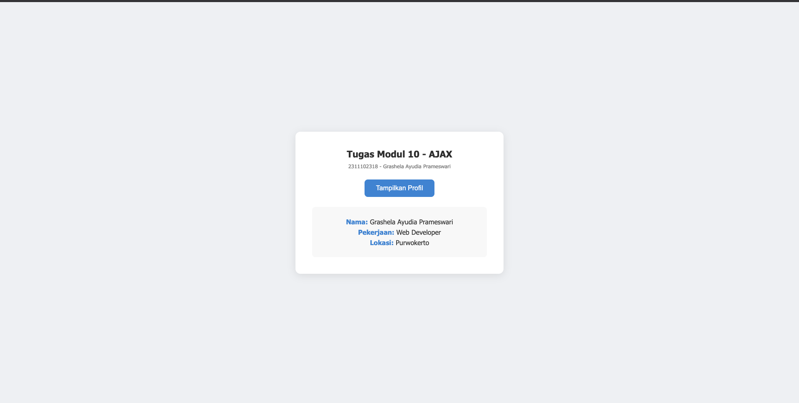

<div align="center">
    <br />
    <h1>LAPORAN PRAKTIKUM <br> APLIKASI BERBASIS PLATFORM </h1>
    <br />
    <h3>MODUL 10 <br> AJAX </h3>
    <br />
    
    <br />
    <br />
    <br />
    <h3>Disusun Oleh :</h3>
    <p>
        <strong>Grashela Ayudia Prameswari</strong>
        <br>
        <strong>2311102318</strong>
        <br>
        <strong>S1 IF-11-05</strong>
    </p>
    <br />
    <h3>Dosen Pengampu :</h3>
    <p>
        <strong>Dedi Agung Prabowo, S.Kom., M.Kom</strong>
    </p>
    <br />
    <br />
    <h4>Asisten Praktikum :</h4>
    <strong>Apri Pandu Wicaksono</strong>
    <br>
    <strong>Hamka Zaenul Ardi</strong>
    <br />
    <h3>LABORATORIUM HIGH PERFORMANCE <br>FAKULTAS INFORMATIKA <br>UNIVERSITAS TELKOM PURWOKERTO <br>2026 </h3>
</div>
<hr>

## Dasar Teori

AJAX (Asynchronous JavaScript and XML) adalah teknik dalam pengembangan web yang memungkinkan aplikasi melakukan pertukaran data dengan server secara asinkron tanpa perlu reload halaman. Dengan AJAX, sebagian konten pada halaman web dapat diperbarui secara dinamis tanpa harus memuat ulang seluruh halaman, sehingga meningkatkan performa dan pengalaman pengguna.

AJAX bekerja dengan memanfaatkan objek seperti `XMLHttpRequest` atau `fetch()` API untuk mengirim dan menerima data dari server, biasanya dalam format JSON. Teknologi ini sering digunakan pada fitur seperti live search, auto-save, notifikasi real-time, dan form submission tanpa refresh halaman.

## Tugas Modul 10 - AJAX

### Source Code

**data.php** — Server yang mengembalikan data JSON

```php
<?php
// Tugas Modul 10 - AJAX
// Nama : Grashela Ayudia Prameswari
// NIM  : 2311102318

header('Content-Type: application/json');

$profil = [
    'nama' => 'Grashela Ayudia Prameswari',
    'pekerjaan' => 'Mahasiswa',
    'lokasi' => 'Purwokerto'
];

echo json_encode($profil);
```

**Kode Lengkap:** [data.php](data.php)

**index.html** — Client dengan AJAX menggunakan fetch()

```html
<!-- Tugas Modul 10 - AJAX -->
<!-- Nama : Grashela Ayudia Prameswari -->
<!-- NIM  : 2311102318 -->

<div class="container">
    <h1>Tugas Modul 10 - AJAX</h1>
    <button id="btn-profil">Tampilkan Profil</button>
    <div id="hasil-profil"></div>
</div>

<script>
    document.getElementById('btn-profil').addEventListener('click', function () {
        fetch('data.php')
            .then(function (response) {
                return response.json();
            })
            .then(function (data) {
                document.getElementById('hasil-profil').innerHTML =
                    'Nama: ' + data.nama +
                    ' | Pekerjaan: ' + data.pekerjaan +
                    ' | Lokasi: ' + data.lokasi;
            })
            .catch(function (error) {
                document.getElementById('hasil-profil').innerHTML =
                    'Gagal mengambil data: ' + error.message;
            });
    });
</script>
```

**Kode Lengkap:** [index.html](index.html)

### Output



### Penjelasan

Website ini adalah halaman AJAX Profil Viewer yang menampilkan tombol "Tampilkan Profil". Ketika tombol diklik, JavaScript menggunakan `fetch()` untuk mengambil data JSON (nama, pekerjaan, lokasi) dari server PHP (`data.php`) secara asinkron. Data profil ditampilkan di halaman dalam format **Nama: Grashela Ayudia Prameswari | Pekerjaan: Mahasiswa | Lokasi: Purwokerto** tanpa perlu me-reload halaman.

---
> **Grashela Ayudia Prameswari — 2311102318**
